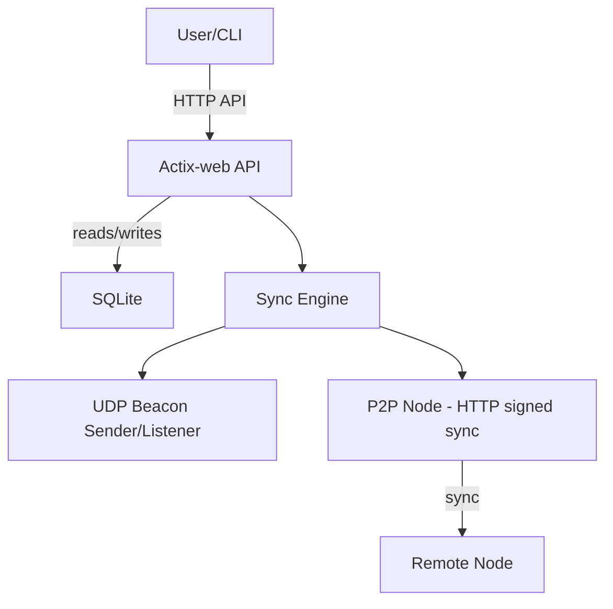
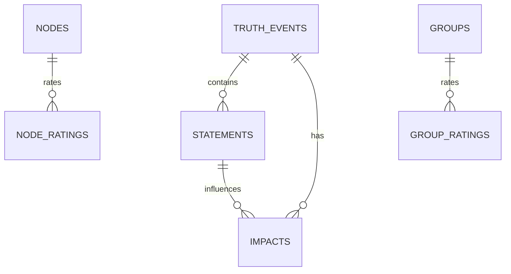

# 🧠 Truth Training

**A peer-to-peer application for truth and context analysis**

---

## Concept

**Core idea**  
Truth Training is a decentralized, peer-to-peer system for collecting, verifying and contextualizing events and claims. It is inspired by the principles of FIDONet (store-and-forward, hub/leaf roles, trust propagation) and uses cryptographic signatures (Ed25519) to ensure author authenticity and data integrity.

**High-level goals**
- Decentralized storage and verification of events.
- Reproducible, auditable history with signed events.
- Peer discovery, synchronization and local diagnostics via CLI.

---

## Quick start

### Requirements
- Rust (recommended ≥ 1.75)
- cargo
- SQLite (libsqlite3-dev)
- Git

### Build & run (development)
```bash
# Clone
git clone https://github.com/USERNAME/truth-training.git
cd truth-training

# Build
cargo build --workspace

# Run node (example)
cargo run --bin truth_core -- --port 8080 --db truth_training.db --http-addr http://127.0.0.1:8080
```

---

## Architecture (brief)

Mermaid: data flow


Mermaid: data model (ER)


### FIDONet-inspired network model
- **Node roles**: *leaf* (edge node) or *hub* (relay/aggregator).
- **Store-and-forward**: nodes store data locally, synchronize on schedule or on-demand.
- **Trust & signatures**: events are signed with Ed25519; public keys identify nodes.
- **Routing & replication**: leaf→hub→hub→leaf; hub nodes relay and aggregate.

---

## API (HTTP, signed endpoints)

All sync-related endpoints require headers:
- `X-Public-Key: <hex>`
- `X-Signature: <hex>`
- `X-Timestamp: <unix>`  
(See spec/05-api.md for canonical signing payloads.)

| Method | Path | Description |
|--------|------|-------------|
| GET    | `/health` | Health check |
| POST   | `/init` | Initialize DB |
| POST   | `/seed` | Load seed knowledge base |
| GET    | `/events` | Get events (signed pull) |
| POST   | `/events` | Add event |
| POST   | `/impacts` | Add impact |
| POST   | `/detect` | Mark detected / perform detection |
| POST   | `/recalc` | Recalculate metrics |
| GET    | `/progress` | Get progress metrics |
| GET    | `/get_data` | Get all data (for sync) |
| GET    | `/statements` | Get statements |
| POST   | `/sync` | Push sync payload |
| POST   | `/incremental_sync` | Incremental sync |
| GET    | `/ratings/nodes` | Node ratings |
| GET    | `/ratings/groups` | Group ratings |
| GET    | `/graph/json` | Graph JSON |
| GET    | `/graph/summary` | Graph summary |

Detailed API schema and examples: **`spec/05-api.md`** and **`docs/CLI_Usage.md`**.

---

## CLI: `truthctl` (administration)

Main capabilities:
- `truthctl init-node [--port <port>] [--db <path>] [--auto-peer]` — initialize node, generate keys.
- `truthctl keys generate [--save]` — generate an Ed25519 keypair (hex).
- `truthctl keys import <priv_hex> <pub_hex>` — import a keypair.
- `truthctl keys list` — list stored key ids.
- `truthctl peers add <url> <pubkey>` — add a peer.
- `truthctl peers list` — list peers.
- `truthctl peers sync-all [--mode full|incremental] [--dry-run]` — sync with all peers.
- `truthctl logs show [--limit N]` — show recent sync logs.
- `truthctl logs clear` — clear sync logs.
- `truthctl config show|set|reset` — manage node config (`~/.truthctl/config.json`).
- `truthctl diagnose [--verbose]` — node diagnostics (config, keys, peers).
- `truthctl reset-data [--confirm] [--reinit]` — wipe local data and optionally reinit (auto key generation/replace).

Examples:
```bash
truthctl keys generate --save
truthctl init-node mynode --port 8080 --db ./node.db --auto-peer
truthctl peers add http://127.0.0.1:8081 <peer_pubkey_hex>
truthctl peers sync-all --mode incremental
truthctl logs show --limit 50
```

Full CLI reference: **`docs/CLI_Usage.md`** and **`spec/10-cli.md`**.

---

## Storage & Sync

- Storage: SQLite via `rusqlite`.
- Tables: `truth_events`, `statements`, `impact`, `node_ratings`, `group_ratings`, `sync_logs`, ...
- Sync modes:
  - **Full sync**: send and receive full datasets (`/sync`).
  - **Incremental sync**: only changes since `last_sync` (`/incremental_sync`).

Trust & reputation:
- `NodeRating` and `GroupRating` models exist in `core-lib`.
- Trust propagation logic (weighted blend & decay) implemented in `core-lib::recalc_ratings` and `merge_ratings`.
- Sync records are stored in `sync_logs` for auditing and diagnostics.

---

## Testing

- Unit & integration tests in `core-lib` and `app` crates.
- Use `cargo test --workspace --features p2p-client-sync` to run with P2P client sync features.
- CLI tests isolate `$HOME` using temporary directories.

---

## Docs & Spec (Spec-Kit)

Primary spec files (in `spec/`):
- `spec/01-product-vision.md`
- `spec/02-requirements.md`
- `spec/03-architecture.md` *(network roles, FIDONet-inspired rules)*
- `spec/05-api.md` *(HTTP API schema)*
- `spec/07-event-rating-protocol.md`
- `spec/10-cli.md` *(CLI commands & config)*
- `spec/14-quality-gates.md`
- `spec/16-test-plan.md`

User docs: `docs/CLI_Usage.md`, `docs/ARCHITECTURE.md`.

---

## Security & Responsible Disclosure

See `SECURITY.md` for the policy. In short:
- Use up-to-date dependencies.
- Report vulnerabilities to the repository owner (see SECURITY.md).
- Signed messages use Ed25519; private keys must be kept secret.

---

## Contributing

See `CONTRIBUTING.md` (or `spec/14-quality-gates.md`) — standards require:
- `cargo fmt` and `cargo clippy` clean runs.
- Tests for new features.
- Spec updates in `spec/` for any protocol or API changes.

---

## License

MIT / Apache-2.0 (TBD — include the license files in repo).

---

## Download this README

If you want the exact Markdown file, download: `sandbox:/mnt/data/README.md`
