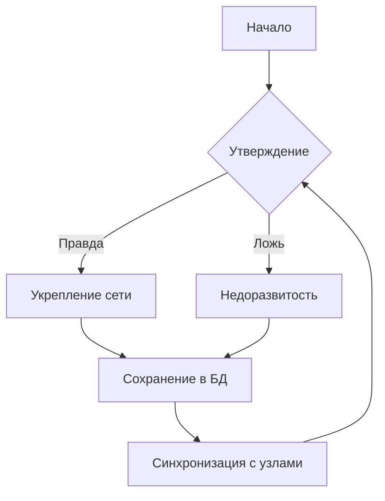

# 🧠 Truth Training
**P2P-приложение для анализа правды и контекста**

---

## 📌 Цели и концепция

**Truth Training** — экспериментальное приложение для **проверки истинности утверждений**, построения контекста и автоматической синхронизации данных между узлами сети **без центрального сервера**.

---

### ✅ Основная идея:
- **Истина** → усиливает доверие, укрепляет связи.
- **Ложь** → ведёт к «недоразвитости» (снижение веса и доверия).
- **Контекст** → корректная интерпретация утверждений, сохранение зависимости.

---

## 🔗 Логическая схема (Mermaid)



---

## ⚙️ Технологический стек
- **Rust** (Actix-web + Tokio)
- **SQLite** (через rusqlite)
- **P2P-синхронизация** (UDP + HTTP)
- **Serde** (JSON)
- **Reqwest** (HTTP клиент)

---

## 🔧 Установка и сборка

```bash
# 1. Клонировать репозиторий
git clone https://github.com/USERNAME/truth-training.git
cd truth-training

# 2. Сборка
cargo build --release

# 3. Запуск
cargo run -- --port 8080 --db truth_training.db
```

---

## 📜 Параметры запуска

```bash
--port <u16>          # Порт HTTP (по умолчанию 8080)
--db <PATH>           # Файл SQLite (по умолчанию truth_training.db)
--http-addr <STRING>  # Явный адрес (http://IP:port)
```

---

## ✅ API endpoints

| Метод | Путь            | Описание                                    |
|-------|-----------------|---------------------------------------------|
| GET   | `/health`       | Проверка сервера                           |
| POST  | `/init`         | Инициализация базы                        |
| POST  | `/seed`         | Загрузка исходных данных                  |
| POST  | `/add_event`    | Добавление события                        |
| POST  | `/detect`       | Анализ несоответствий                     |
| POST  | `/impact`       | Расчёт влияния                            |
| POST  | `/recalc`       | Пересчёт связей                           |
| GET   | `/get_data`     | Получение всех данных                     |
| POST  | `/add_statement`| Добавление утверждения                    |

---

## 📡 Тестирование P2P на одном ПК

Запускаем несколько узлов на разных портах:

```bash
cargo run -- --port 8080 --db node1.db --http-addr http://127.0.0.1:8080
cargo run -- --port 8081 --db node2.db --http-addr http://127.0.0.1:8081
cargo run -- --port 8082 --db node3.db --http-addr http://127.0.0.1:8082
```

---

## 📥 Скачать этот README.md

После загрузки на GitHub:  
[Скачать файл README.md](https://github.com/USERNAME/truth-training/blob/main/README.md)
