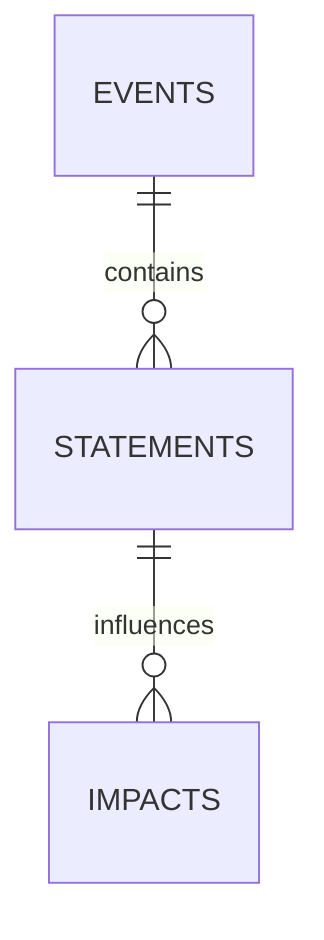

# 🧠 Truth Training
**P2P-приложение для анализа правды и контекста**

---

## 📌 Цели и концепция
Приложение предназначено для анализа событий, связанных с правдой и ложью, с учетом контекста. 
Основная цель — фиксировать события, строить связи, оценивать влияние лжи и формировать систему знаний.
**Truth Training** — экспериментальное приложение для **проверки истинности утверждений**, построения контекста и автоматической синхронизации данных между узлами сети **без центрального сервера**.

---

### ✅ Основная идея:
- **Истина** → усиливает доверие, укрепляет связи.
- **Ложь** → ведёт к «недоразвитости» (снижение веса и доверия).
- **Контекст** → корректная интерпретация утверждений, сохранение зависимости.

---

## 📌 Описание проекта
**Truth Training** — это распределённая система на основе P2P-сети, позволяющая узлам:
- Обмениваться информацией о событиях;
- Синхронизировать данные через **UDP-маяки (beacons)**;
- Оценивать достоверность утверждений с помощью **встроенного эксперта (алгоритм анализа лжи)**;
- Работать в оффлайн-режиме с последующей синхронизацией.

Цель: создать децентрализованную базу событий с проверкой фактов на уровне каждого узла.

---

## 🔍 Основные возможности
✔ Обнаружение пиров в локальной сети (UDP Broadcast, порт `37020`);  
✔ Репликация данных через HTTP API;  
✔ Добавление и редактирование событий;  
✔ Запрос достоверности утверждений (**детектор лжи**);  
✔ Периодическая синхронизация данных между узлами.

## 🔗 Логическая схема (Mermaid)
```mermaid
flowchart TD
    A[Начало] --> B{Утверждение}
    B --> |Правда| C[Укрепление сети]
    B --> |Ложь| D[Недоразвитость]
    C --> E[Сохранение в БД]
    D --> E
    E --> F[Синхронизация с узлами]
    F --> B
📊 Архитектура данных
flowchart TD
    A[Событие] --> B[Контекст]
    B --> C[Экспертная оценка]
    C --> D[Влияние лжи]
🌐 Архитектура сети
flowchart TD
    A[HTTP API / Actix-web] --> B[SQLite DB]
    A --> C[Sync Engine]
    C --> D[UDP Beacon Sender]
    C --> E[UDP Beacon Listener]
    E -->|Новые пировые адреса| C
    A --> F[Expert System (Detector)]


## ⚙️ Технологический стек
- **Rust** (Actix-web + Tokio)
- **SQLite** (через rusqlite)
- **P2P-синхронизация** (UDP + HTTP)
- **Serde** (JSON)
- **Reqwest** (HTTP клиент)

---

### Требования:
- **Rust** ≥ 1.75
- **cargo**
- **SQLite**
- **actix-web**, **tokio**, **serde**, **reqwest**

---

## 🔧 Установка и сборка

``bash
# Установка зависимостей
sudo apt update && sudo apt install -y libsqlite3-dev pkg-config


```bash
# 1. Клонировать репозиторий
git clone https://github.com/USERNAME/truth-training.git
cd truth-training

# Проверка
cargo check

# 2. Сборка
cargo build --release

# 3. Запуск
cargo run -- --port 8080 --db truth_training.db
```
# Запуск HTTP-сервера с синхронизацией
./target/release/truth_training --port 8080 --db truth_training.db

---

## 📜 Параметры запуска

```bash
--port <u16>          # Порт HTTP (по умолчанию 8080)
--db <PATH>           # Файл SQLite (по умолчанию truth_training.db)
--http-addr <STRING>  # Явный адрес (http://IP:port)
```

---

## ✅ API endpoints

| Метод | Путь            | Описание                                    |
|-------|-----------------|---------------------------------------------|
| GET   | `/health`       | Проверка сервера                           |
| POST  | `/init`         | Инициализация базы                        |
| POST  | `/seed`         | Загрузка исходных данных                  |
| POST  | `/add_event`    | Добавление события                        |
| POST  | `/detect`       | Анализ несоответствий                     |
| POST  | `/impact`       | Расчёт влияния                            |
| POST  | `/recalc`       | Пересчёт связей                           |
| GET   | `/get_data`     | Получение всех данных                     |
| POST  | `/add_statement`| Добавление утверждения                    |
Примеры использования:
```bash
# Проверка состояния
curl http://127.0.0.1:8080/health

# Добавление события
curl -X POST http://127.0.0.1:8080/add_event   -H "Content-Type: application/json"   -d '{"description":"Пример события","context":2,"vector":false}'
```
---

## 📡 Тестирование P2P на одном ПК

Запускаем несколько узлов на разных портах:

```bash
cargo run -- --port 8080 --db node1.db --http-addr http://127.0.0.1:8080
cargo run -- --port 8081 --db node2.db --http-addr http://127.0.0.1:8081
cargo run -- --port 8082 --db node3.db --http-addr http://127.0.0.1:8082
```
---

## 🗄 Структура базы данных (ER-модель)

**Основные таблицы:**
- **events** — события (id, title, description, timestamp, trust_score)
- **statements** — утверждения, связанные с событиями
- **impacts** — влияние утверждений на достоверность



---

## 🌐 API и команды

### 1. **Проверка работоспособности**
```bash
curl http://localhost:8080/health
```

### 2. **Инициализация базы**
```bash
curl -X POST http://localhost:8080/init
```

### 3. **Добавить событие**
```bash
curl -X POST http://localhost:8080/add_event     -H "Content-Type: application/json"     -d '{"title":"Инцидент X","description":"Подробности..."}'
```

### 4. **Добавить утверждение**
```bash
curl -X POST http://localhost:8080/add_statement     -H "Content-Type: application/json"     -d '{"event_id":1,"text":"Это правда"}'
```

### 5. **Запустить детекцию лжи**
```bash
curl -X POST http://localhost:8080/detect     -H "Content-Type: application/json"     -d '{"statement_id":1}'
```

### 6. **Синхронизация с пирами**
Автоматическая через UDP-маяки + HTTP.

---

## 🧠 Встроенный эксперт
Алгоритм оценки достоверности использует:
- Веса утверждений;
- Связь событий и источников;
- Сетевую согласованность данных.

Результат:
- **trust_score ∈ [0,1]** для каждого события.

---
---

## 📦 Исторические команды CLI (устаревший режим)
На раннем этапе приложение работало через консоль с командами для управления базой данных.

**Примеры:**
```bash
# Инициализация БД
cargo run -p app -- --db truth_db.sqlite init

# Добавление события
cargo run -p app -- --db truth_db.sqlite add-event   --description "Сокрытие факта в разговоре" --context 2 --vector false

# Запуск детектора лжи
cargo run -p app -- --db truth_db.sqlite detect --id 1 --detected false
```

Полный список команд смотри [command.txt](command.txt).

---

## 🔄 Текущий подход
CLI-команды **заменены API-вызовами**, т.к. проект переходит в формат:
- **библиотеки** для интеграции с Android-приложением;
- управление выполняется через **HTTP API**.

Для теста API можно использовать `curl` (см. раздел **API endpoints**).

---

## 📌 План перехода:
1. Вынести всю бизнес-логику в библиотеку `truth-core`;
2. Добавить обёртку для Android через `ffi` (или `uniFFI`);
3. API на Rust оставить для тестов и P2P-синхронизации.
## 📥 Скачать этот README.md

После загрузки на GitHub:  
[Скачать файл README.md](https://github.com/ekwator/truth-training/blob/main/README.md)
