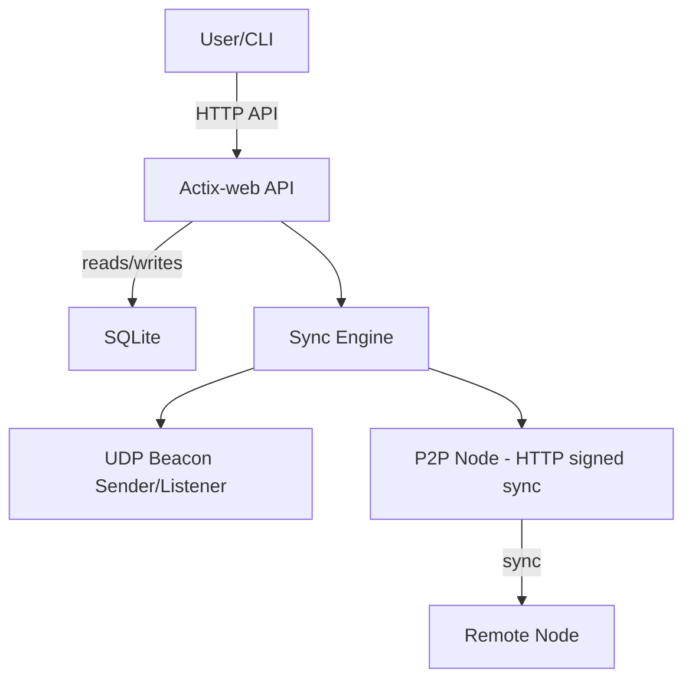
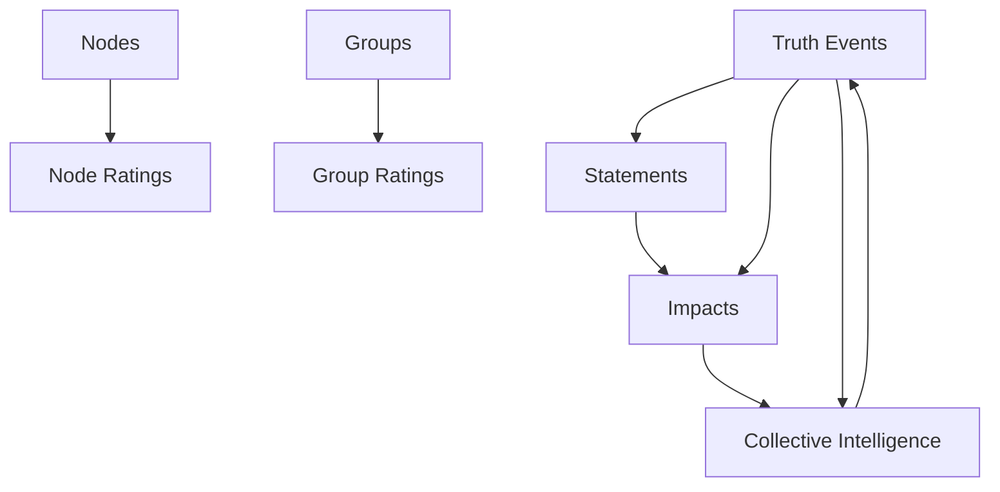
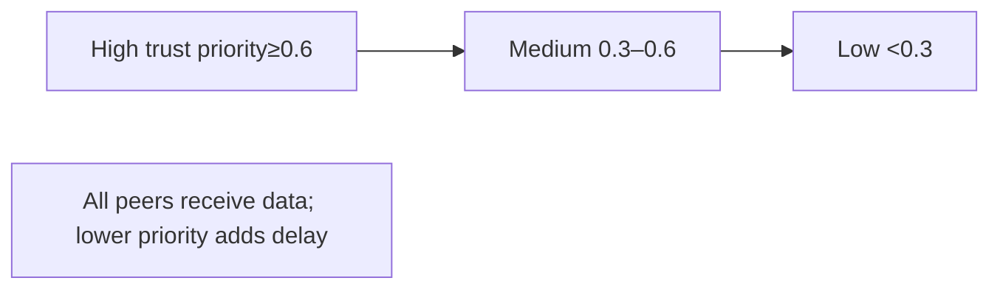

# 🌐 Truth Training — The Network of Anonymous Trust  
*(Created in Cursor AI IDE)*

Truth Training is a decentralized communication ecosystem where **truth travels without identity**.  
Events move freely through the network — encrypted, verified, and echoed by others — creating a distributed field of awareness instead of a chain of messages.

Each reflection of an event confirms its existence; each independent echo increases its credibility.  
Like confession without a priest, users anonymously release truths into the network — and the collective conscience responds.

It can serve as an **alternative to voting systems**, measuring the authenticity of social signals and public sentiment not through ballots, but through shared evaluation of facts.

Unlike LoRa-based mesh systems such as **Meshtastic**, Truth Training builds a **mesh of minds, not hardware** — using Wi-Fi and the Internet as carriers of encrypted meaning, forming an autonomous infrastructure of human understanding.

Originally conceived to combat fraud, Truth Training evolves into a **self-learning immunity against falsehood** — distinguishing truth from deception through context, correlation, and collective resonance.

---

## 🚫 No Bans. No Muting. No Administrative Suppression.

A fundamental principle of Truth Training is **absolute non-censorship**:

- **No user can be banned.**  
- **No message can be deleted or blocked.**  
- **No administrator or server operator can silence, shadow-ban, or filter participants.**

The system is designed so that **no central authority exists** with the ability to suppress information or exclude individuals.

All data flows are governed by:

- **cryptographic identity**,  
- **context evaluation**,  
- **decentralized consensus**,  
- **and distributed replication**,  

—not by human moderation or arbitrary rules.

Instead of punishment or exclusion, the network uses:

- **context-based interpretation**
- **collective impact scoring**
- **correlation across independent nodes**
- **temporal decay and natural fading of irrelevant data**

This forms an **organic, self-regulating signal ecosystem**, where falsehood loses weight naturally — not because someone censored it, but because **the network rejects it collectively**.

Truth Training is not a platform where content is controlled.  
It is a field where meaning **emerges**.

---

## Release Information

**v1.0.0-Release**: [GitHub Release v1.0.0-Release](https://github.com/ekwator/truth-training/releases/tag/v1.0.0-Release)

**v1.0.0-Baseline**: [GitHub Release v1.0.0-Baseline](https://github.com/ekwator/truth-training/releases/tag/v1.0.0-Baseline)

## What's New in v1.0.0-Release

Truth Training v1.0.0-Release — Unified Discovery & Sync Release

Truth Training v1.0.0-Release ships the finished, unified discovery stack for Desktop, CLI, Server, and Android clients. Every platform now speaks the same node schema, discovery protocol, and sync cadence, providing a seamless view of the network whether you manage nodes from a workstation, the terminal, or a phone.

Highlights:
- Unified cross-platform node discovery pipeline with shared data formats and conflict-free merge logic.
- LAN/Wi-Fi UDP multicast (239.255.0.1:52525) and HTTPS registry polling run together to cover both local presence and global awareness.
- Automated reachability checks with TTL-based cleanup keep node lists self-healing and trustworthy.
- Android client now bundles Room DB storage, WorkManager background sync, and Compose UI so mobile operators see the same live roster as desktop and CLI users.
- Desktop, CLI, and Server releases expose matching controls (dashboard widgets, `truthctl` commands, HTTP endpoints) for discovery, sync, cleanup, and health checks.

Quality & Validation:
- Real-device end-to-end testing (desktop ↔ CLI ↔ Android) confirms multicast, registry polling, and sync interoperability on physical hardware and mixed networks.
- Observability hooks record discovery counts, TTL pruning, and reachability metrics in every runtime, making deployment diagnostics straightforward.

Enjoy the most complete Truth Training release to date—fully aligned discovery logic everywhere, minimal configuration, and proven reliability in the field.

## What's New in v1.0.0-Baseline

This release represents the baseline version of Truth Training v1.0.0, featuring:
- **FIDONet-inspired Architecture**: Store-and-forward messaging with hub/leaf node roles
- **Cryptographic Verification**: Ed25519 signatures for event authentication and data integrity
- **Peer-to-Peer Synchronization**: UDP beacon discovery and HTTP-based signed sync
- **Trust Propagation System**: Node ratings with propagation priority metrics
- **Cross-Platform Core**: Shared Rust library for desktop, Android, and iOS
- **Offline-First Design**: Quality index for mobile/offline fairness without time-based decay
- **Collective Intelligence**: Wisdom of the Crowd consensus mechanism for event evaluation

## What's New in v1.0.0

- **Context Fields Embedded**: Events now store context fields (`category_id`, `forma_id`, `cause_id`, `develop_id`, `effect_id`) directly, eliminating the need for `context_id` foreign key lookups
- **Context Template System**: New Context Editor UI screen for creating and managing reusable context templates
- **Template-Based Event Creation**: Template selection auto-prefills event form fields, streamlining event entry
- **Enhanced API**: New endpoints for context template management, matching, and creation from events
- **Improved Performance**: Reduced query overhead by removing JOINs required for context information
- **Data Integrity**: Foreign key validation and duplicate template detection ensure data consistency
- **Breaking Changes**: Manual database migration required — see migration notes in CHANGELOG

## What's New in v0.4.2

- **Desktop Integration**: Complete Tauri-based desktop UI with React frontend
- **Cross-Platform Builds**: Production-ready packages for Linux, Windows, and macOS
- **CI/CD Pipeline**: Automated builds for desktop, Android, and iOS platforms
- **Mobile Integration**: Android and iOS client frameworks with Rust FFI bridges
- **Build System**: Comprehensive troubleshooting documentation and dependency management
- **Icon System**: Dynamic icon generation for all platforms

## What's New in v0.4.0

- **Collective Intelligence Layer**: Wisdom of the Crowd consensus mechanism for event evaluation
- **Offline Reliability Update**: Quality index without time-based decay for mobile/offline fairness
- **Unified Documentation**: All documentation translated to English with complete Spec-Kit traceability
- **Android JSON Verification**: Ed25519 signature verification for mobile clients
- **Enhanced P2P Sync**: Improved trust propagation and conflict resolution

## Concept

**Core idea**  
Truth Training is a decentralized, peer-to-peer system for collecting, verifying and contextualizing events and claims. It is inspired by the principles of FIDONet (store-and-forward, hub/leaf roles, trust propagation) and uses cryptographic signatures (Ed25519) to ensure author authenticity and data integrity.

**High-level goals**
- Decentralized storage and verification of events.
- Reproducible, auditable history with signed events.
- Peer discovery, synchronization and local diagnostics via CLI.

---

## Quick start

### Requirements
- Rust (recommended ≥ 1.75)
- cargo
- SQLite (libsqlite3-dev)
- Git

### Build & run (development)
```bash
# Clone
git clone https://github.com/USERNAME/truth-training.git
cd truth-training

# Build
cargo build --workspace

# Run node (example)
cargo run --bin truth_core -- --port 8080 --db truth_training.db --http-addr http://127.0.0.1:8080
```

---

## Cross-Platform Architecture

Truth Training uses a **cross-platform core library** (`truth_core`) that adapts to different platforms:

- **Desktop** (Linux, Windows, macOS): Full feature set with HTTP server, CLI tools, and complete P2P networking
- **Mobile** (iOS, Android): Minimal subset with FFI interfaces for native app integration

## 📱 Mobile Client Integration

### Android Client
The Android client (`truth-android-client`) is now part of the monorepo under `/truth-android-client`.
It is an independent Android application built on top of the shared Truth Core engine.

## iOS Client

The iOS client (`truth-ios-client`) is currently only a **prototype stub** included in the monorepo under `/truth-ios-client`.

It is **not a functional application** — only an experimental placeholder created during early architectural testing.  
I have **not developed the iOS version**, as I do not yet have experience with iOS development.

We welcome **community contributions and volunteers** who can help implement:

- Swift / SwiftUI application structure  
- FFI bindings to the Truth Core engine  
- Shared discovery & sync layer  
- UI and navigation system  
- Full feature parity with Android & Desktop clients  

If you're experienced with Swift or iOS development and want to contribute, feel free to join the project!

### Platform-Specific Features

**Desktop Features:**
- HTTP REST API server
- CLI management tools (`truthctl`)
- Complete P2P synchronization
- Web-based administration interface
- Full async runtime (Tokio)

**Mobile Features:**
- Minimal P2P protocol
- Ed25519 cryptographic operations
- FFI interfaces for native apps
- Lightweight async runtime (Smol)
- JSON signature verification

### Build Commands

```bash
# Desktop (full features)
cargo build --release --features desktop --bin truth_core

# Android (minimal features)
cargo build --release --target aarch64-linux-android --features mobile --lib -p truth_core

# iOS (minimal features)
cargo build --release --target aarch64-apple-ios --features mobile --lib -p truth_core
```

See `spec/19-build-instructions.md` for detailed cross-platform build instructions.

Mermaid: data flow

```mermaid
flowchart TD
    Client[User/CLI] -->|HTTP API| API[Actix-web API]
    API -->|reads/writes| DB[SQLite]
    API --> Sync[Sync Engine]
    Sync --> Beacon[UDP Beacon Sender/Listener]
    Sync --> P2P["P2P Node - HTTP signed sync"]
    P2P -->|sync| Peer[Remote Node]
```

Mermaid: data model relationships

```mermaid
flowchart TD
    TE[Truth Events] --> ST[Statements]
    ST --> IM[Impacts]
    TE --> IM
    ND[Nodes] --> NR[Node Ratings]
    GP[Groups] --> GR[Group Ratings]
    
    TE --> CI[Collective Intelligence]
    IM --> CI
    CI --> TE
```

### FIDONet-inspired network model
- **Node roles**: *leaf* (edge node) or *hub* (relay/aggregator).
- **Store-and-forward**: nodes store data locally, synchronize on schedule or on-demand.
- **Trust & signatures**: events are signed with Ed25519; public keys identify nodes.
- **Routing & replication**: leaf→hub→hub→leaf; hub nodes relay and aggregate.

---

## API (HTTP, signed endpoints + JWT + RBAC)

All sync-related endpoints require headers:
- `X-Public-Key: <hex>`
- `X-Signature: <hex>`
- `X-Timestamp: <unix>`  
(See spec/05-api.md for canonical signing payloads.)

### Authentication & Tokens

- `POST /api/v1/auth` — verify signed headers (`X-Public-Key`, `X-Signature`, `X-Timestamp` with message `auth:<ts>`), returns short-lived JWT (1h) and refresh token (24h).
- `POST /api/v1/refresh` — exchange valid refresh token for a new JWT pair (refresh rotates).
- Protected routes (require `Authorization: Bearer <token>`):
  - `POST /api/v1/recalc`
  - `POST /api/v1/ratings/sync`
  - `POST /api/v1/reset`
  - `POST /api/v1/reinit`

Error format (401): `{ "error": "unauthorized", "code": 401 }`.

| Method | Path | Description |
|--------|------|-------------|
| GET    | `/health` | Health check |
| POST   | `/init` | Initialize DB |
| POST   | `/seed` | Load seed knowledge base |
| GET    | `/events` | Get events (signed pull) |
| POST   | `/events` | Add event |
| POST   | `/impacts` | Add impact |
| POST   | `/detect` | Mark detected / perform detection |
| POST   | `/recalc` | Recalculate metrics |
| POST   | `/recalc_ratings` | Recalculate node/group ratings |
| POST   | `/api/v1/auth` | Issue JWT/refresh via Ed25519 signed headers |
| POST   | `/api/v1/refresh` | Rotate refresh, return new JWT pair |
| GET    | `/api/v1/users` | List users (admin) |
| POST   | `/api/v1/users/role` | Grant/revoke roles (admin) |
| POST   | `/api/v1/trust/delegate` | Delegate trust (role ≥ node) |
| POST   | `/api/v1/recalc` | Protected recalc via Bearer JWT |
| POST   | `/api/v1/ratings/sync` | Protected broadcast ratings via Bearer JWT |
| GET    | `/progress` | Get progress metrics |
| GET    | `/get_data` | Get all data (for sync) |
| GET    | `/statements` | Get statements |
| POST   | `/statements` | Add statement |
| POST   | `/sync` | Push sync payload |
| POST   | `/incremental_sync` | Incremental sync |
| POST   | `/ratings/sync` | Broadcast ratings to peers |
| GET    | `/ratings/nodes` | Node ratings |
| GET    | `/ratings/groups` | Group ratings |
| GET    | `/graph` | Graph data |
| GET    | `/graph/json` | Graph JSON (filtered) with propagation metrics |
| GET    | `/graph/summary` | Graph summary |
| GET    | `/api/v1/stats` | Node stats with propagation & relay metrics |
| POST   | `/api/v1/recalc_collective` | Recalculate collective truth score (Wisdom of the Crowd) |

### Android Integration

Truth Core supports Android integration through FFI bindings and JSON signature verification. For detailed integration instructions, see `integration/android/README_INTEGRATION.md`.

**Key Features:**
- Ed25519 JSON signature verification for secure communication
- Minimal P2P protocol optimized for mobile
- FFI interface for native Android apps
- Cross-compilation support for aarch64-linux-android

**Build for Android:**
```bash
cargo build --release --target aarch64-linux-android --features mobile
```

### Running Tests

**Desktop Feature Tests:**
```bash
# Run all desktop feature tests
cargo test --features desktop

# Run specific test (e.g., LAN announcement roundtrip)
cargo test --features desktop lan_announcement_roundtrip

# Run with verbose output
cargo test --features desktop -- --nocapture
```

**CLI End-to-End Tests:**
```bash
# Run CLI sync tests
cargo test --test cli_sync --features p2p-client-sync --package app --bin truthctl

# Run all tests
cargo test --all
```

**Android Instrumentation Tests:**
```bash
cd truth-android-client

# Run on connected device
./gradlew connectedDebugAndroidTest

# Run specific test class
./gradlew connectedDebugAndroidTest --tests "com.truth.training.client.NodeDiscoveryTest"
```

**Cross-Platform Integration Tests:**
```bash
# TTL consistency tests
cargo test --test test_ttl_consistency

# JSON enum serialization tests
cargo test --test test_json_enum_serialization
```

**Example JNI Integration:**
```kotlin
// Native function call
external fun processJsonRequest(json: String): String

// Usage
val response = processJsonRequest("""
{
    "action": "ping",
    "timestamp": 1640995200
}
""")
```

Detailed integration guides: **`integration/android/README_INTEGRATION.md`**, **`integration/ios/README_INTEGRATION.md`**, and **`integration/desktop/README_INTEGRATION.md`**.

---

## CLI: `truthctl` (administration)

Main capabilities:
- `truthctl init-node [--port <port>] [--db <path>] [--auto-peer]` — initialize node, generate keys.
- `truthctl keys generate [--save]` — generate an Ed25519 keypair (hex).
- `truthctl keys import <priv_hex> <pub_hex>` — import a keypair.
- `truthctl keys list` — list stored key ids.
- `truthctl peers add <url> <pubkey>` — add a peer.
- `truthctl peers list` — list peers.
- `truthctl peers sync-all [--mode full|incremental] [--dry-run]` — sync with all peers.
- `truthctl logs show [--limit N]` — show recent sync logs.
- `truthctl logs clear` — clear sync logs.
- `truthctl config show|set|reset` — manage node config (`~/.truthctl/config.json`).
- `truthctl diagnose [--verbose]` — node diagnostics (config, keys, peers).
- `truthctl reset-data [--confirm] [--reinit]` — wipe local data and optionally reinit (auto key generation/replace).
- `truthctl graph show [--format json|ascii] [--min-priority 0.3] [--limit 50]` — visualize network graph with propagation metrics.
- `truthctl peers stats [--server URL] [--format json|table]` — local peer statistics (success rate, quality, trust).
- `truthctl peers history [--limit N] [--db path]` — peer sync history from local DB.

Examples:
```bash
truthctl keys generate --save
truthctl init-node mynode --port 8080 --db ./node.db --auto-peer
truthctl peers add http://127.0.0.1:8081 <peer_pubkey_hex>
truthctl peers sync-all --mode incremental
truthctl logs show --limit 50
truthctl graph show --format ascii --min-priority 0.5
truthctl status  # shows network health metrics
truthctl peers stats --format table
truthctl peers history --limit 20 --db ./node.db
```

Full CLI reference: **`docs/CLI_Usage.md`** and **`spec/10-cli.md`**.

---

## Storage & Sync

- Storage: SQLite via `rusqlite`.
- Tables: `truth_events`, `statements`, `impact`, `node_ratings`, `group_ratings`, `sync_logs`, ...
- Sync modes:
  - **Full sync**: send and receive full datasets (`/sync`).
 - **Incremental sync**: only changes since `last_sync` (`/incremental_sync`).

Trust & reputation:
- `NodeRating` now includes `propagation_priority` (0.0–1.0). It is computed as: `priority = trust_norm*0.8 + recent_activity*0.2`, where `trust_norm = (trust_score+1)/2`.
- Non-discriminatory mode: all nodes can sync; trust only affects propagation order and delays. Low-trust peers are delayed, never excluded.
- Trust propagation (blend and decay) lives in `core::recalc_ratings` and `merge_ratings`. Priority is refreshed automatically after merges and recalculations.
- Sync records are stored in `sync_logs` for auditing and diagnostics.

Adaptive Propagation Metrics:
- propagation_priority (0.0–1.0) — EMA-smoothed blend of trust and network metrics:
  - p_raw = 0.4·trust_norm + 0.3·quality_index + 0.3·relay_success_rate
 - trust_norm = ((trust_score+1)/2), p = 0.3·p_raw + 0.7·prev
- Network propagation: blend_priority(local, remote) = clamp(0.8·local + 0.2·remote, 0..1)
- Displayed in CLI: priority 🔵/🟡/🔴; average value in `truthctl status`.

Relay metrics & adaptive quality tracking:
- Dynamic relay success rate tracking via `record_relay_result(peer_url, success)` in sync functions.
- Real-time metrics stored in `node_metrics` table with `relay_success_rate` (0.0–1.0) and `quality_index` (0.0–1.0).
- `quality_index` — continuous trust indicator for mobile/offline nodes. This is not a penalty metric.
  - Local calculation: `q_raw = 0.5·relay_success_rate + 0.3·conflict_free_ratio + 0.2·trust_score_stability`, then EMA: `q = 0.3·q_raw + 0.7·prev`.
  - Network propagation: `blend_quality(local, remote) = clamp(0.8·local + 0.2·remote, 0..1)`.
- CLI displays relay and quality: relay 🟢🟡🔴, quality 🔵🟡🔴; shows average network quality.
- API `/api/v1/stats` returns `avg_quality_index`; `/graph/json` includes `quality_index` on nodes.

### Local Network Statistics & Peer History

- New SQLite table `peer_history` tracks per-peer sync attempts (success/fail counters, last sync timestamp, last observed `quality_index` and `trust_score`).
- Automatic logging after each sync attempt updates `peer_history`.
- API `GET /api/v1/network/local` returns:
 - `peers`: list with `url`, `last_sync` (RFC3339), `success_count`, `fail_count`, `last_quality_index`, `last_trust_score`.
  - `summary`: `total_peers`, `avg_success_rate`, `avg_quality_index`.
- CLI:
  - `truthctl peers stats [--format json|table]` — shows table and averages.
  - `truthctl peers history [--limit N] [--db path]` — prints recent history rows.

Example JSON for `/api/v1/network/local`:
```json
{
  "peers": [
    {
      "url": "http://127.0.1:8080",
      "last_sync": "2025-10-11T13:00:00Z",
      "success_count": 24,
      "fail_count": 3,
      "last_quality_index": 0.85,
      "last_trust_score": 0.91
    }
  ],
  "summary": {
    "total_peers": 12,
    "avg_success_rate": 0.8,
    "avg_quality_index": 0.83
 }
}
```

Relay priority (Mermaid):

```mermaid
flowchart LR
    A[High trust priority≥0.6] --> B[Medium 0.3–0.6] --> C[Low <0.3]
    note[All peers receive data; lower priority adds delay]
```

---

## Testing

- Unit & integration tests in `core` and `app` crates.
- Use `cargo test --workspace --features p2p-client-sync` to run with P2P client sync features.
- CLI tests isolate `$HOME` using temporary directories.

---

## Docs & Spec (Spec-Kit)

Primary spec files (in `spec/`):
- `spec/01-product-vision.md`
- `spec/02-requirements.md`
- `spec/03-architecture.md` *(network roles, FIDONet-inspired rules)*
- `spec/05-api.md` *(HTTP API schema)*
- `spec/07-event-rating-protocol.md`
- `spec/10-cli.md` *(CLI commands & config)*
- `spec/14-quality-gates.md`
- `spec/16-test-plan.md`

- User docs: `docs/CLI_Usage.md`, `docs/ARCHITECTURE.md`, [`docs/api_reference/API_REFERENCE.md`](docs/api_reference/API_REFERENCE.md).
- Android docs: `docs/ANDROID_MIGRATION.md`, `docs/ANDROID_TEST_FIX_SUGGESTIONS.md`, `docs/TEST_REPORT_ANDROID_v1.0.0.md`
- Shared references: `docs/VERSION_REGISTRY.md`
- Design index: [`docs/DESIGN_INDEX.md`](docs/DESIGN_INDEX.md) — cross-reference for every spec/plan.

---

## Security & Responsible Disclosure

See `SECURITY.md` for the policy. In short:
- Use up-to-date dependencies.
- Report vulnerabilities to the repository owner (see SECURITY.md).
- Signed messages use Ed25519; private keys must be kept secret.

---

## Contributing

See `CONTRIBUTING.md` (or `spec/14-quality-gates.md`) — standards require:
- `cargo fmt` and `cargo clippy` clean runs.
- Tests for new features.
- Spec updates in `spec/` for any protocol or API changes.

---

## License

This project is licensed under the GNU Lesser General Public License v3.0 (LGPL-3.0). See LICENSE.txt for details.

---

## Download this README

If you want the exact Markdown file, download: `sandbox:/mnt/data/README.md`
