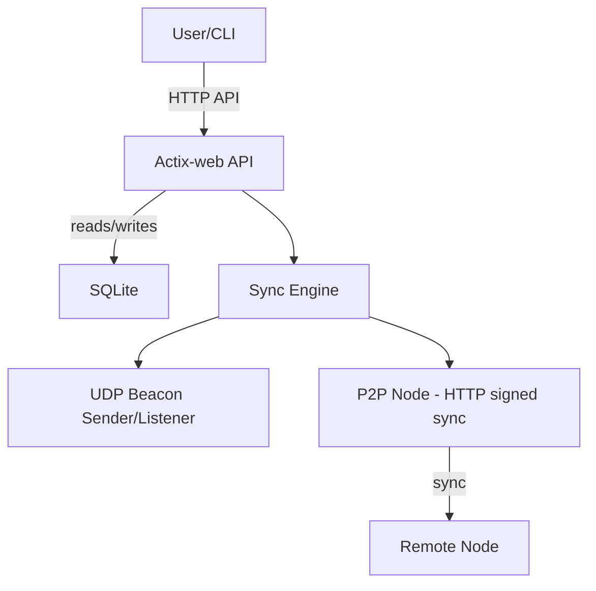
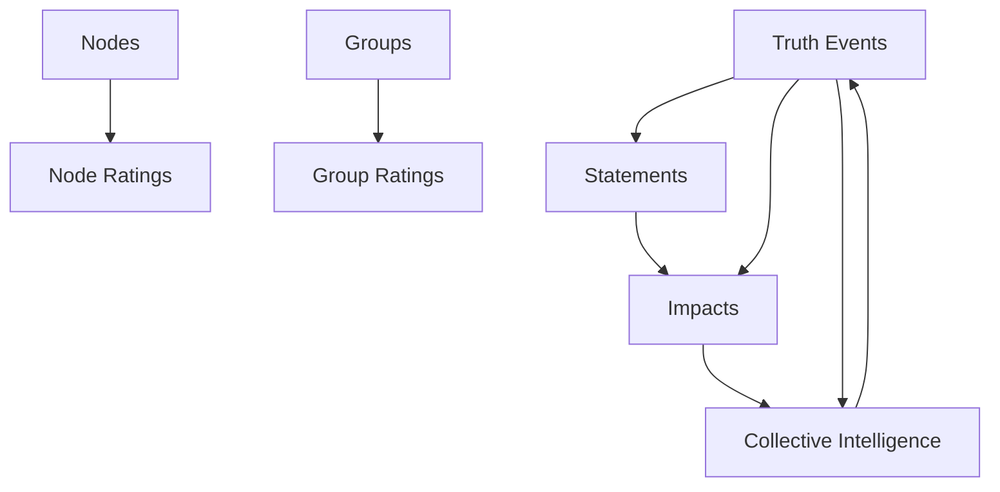
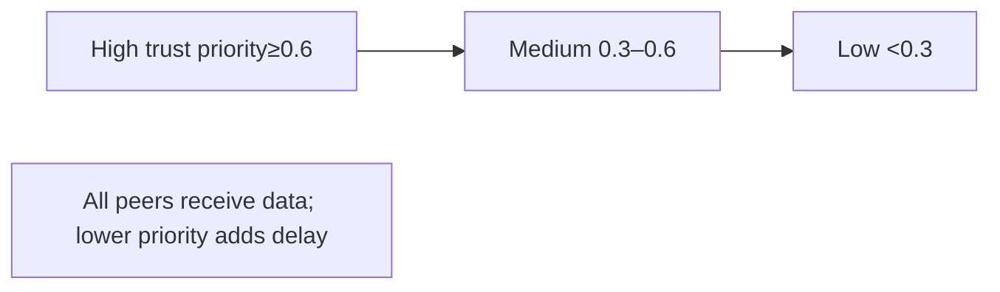

# 🧠 Truth Training v0.4.0

**A distributed collective intelligence system for evaluating truth through trust-weighted consensus**

---

## What's New in v0.4.0

- **Collective Intelligence Layer**: Wisdom of the Crowd consensus mechanism for event evaluation
- **Offline Reliability Update**: Quality index without time-based decay for mobile/offline fairness
- **Unified Documentation**: All documentation translated to English with complete Spec-Kit traceability
- **Android JSON Verification**: Ed25519 signature verification for mobile clients
- **Enhanced P2P Sync**: Improved trust propagation and conflict resolution

## Concept

**Core idea**  
Truth Training is a decentralized, peer-to-peer system for collecting, verifying and contextualizing events and claims. It is inspired by the principles of FIDONet (store-and-forward, hub/leaf roles, trust propagation) and uses cryptographic signatures (Ed25519) to ensure author authenticity and data integrity.

**High-level goals**
- Decentralized storage and verification of events.
- Reproducible, auditable history with signed events.
- Peer discovery, synchronization and local diagnostics via CLI.

---

## Quick start

### Requirements
- Rust (recommended ≥ 1.75)
- cargo
- SQLite (libsqlite3-dev)
- Git

### Build & run (development)
```bash
# Clone
git clone https://github.com/USERNAME/truth-training.git
cd truth-training

# Build
cargo build --workspace

# Run node (example)
cargo run --bin truth_core -- --port 8080 --db truth_training.db --http-addr http://127.0.0.1:8080
```

---

## Cross-Platform Architecture

Truth Training uses a **cross-platform core library** (`truth_core`) that adapts to different platforms:

- **Desktop** (Linux, Windows, macOS): Full feature set with HTTP server, CLI tools, and complete P2P networking
- **Mobile** (iOS, Android): Minimal subset with FFI interfaces for native app integration

## 📱 Android Client Integration

The Android client (`truth-android-client`) is now part of the monorepo under `/truth-android-client`.
It is an independent Android application built on top of the shared Truth Core engine.

### Platform-Specific Features

**Desktop Features:**
- HTTP REST API server
- CLI management tools (`truthctl`)
- Complete P2P synchronization
- Web-based administration interface
- Full async runtime (Tokio)

**Mobile Features:**
- Minimal P2P protocol
- Ed25519 cryptographic operations
- FFI interfaces for native apps
- Lightweight async runtime (Smol)
- JSON signature verification

### Build Commands

```bash
# Desktop (full features)
cargo build --release --features desktop --bin truth_core

# Android (minimal features)
cargo build --release --target aarch64-linux-android --features mobile --lib -p truth_core

# iOS (minimal features)
cargo build --release --target aarch64-apple-ios --features mobile --lib -p truth_core
```

See `spec/19-build-instructions.md` for detailed cross-platform build instructions.

Mermaid: data flow

```mermaid
flowchart TD
    Client[User/CLI] -->|HTTP API| API[Actix-web API]
    API -->|reads/writes| DB[SQLite]
    API --> Sync[Sync Engine]
    Sync --> Beacon[UDP Beacon Sender/Listener]
    Sync --> P2P["P2P Node - HTTP signed sync"]
    P2P -->|sync| Peer[Remote Node]
```

Mermaid: data model relationships

```mermaid
flowchart TD
    TE[Truth Events] --> ST[Statements]
    ST --> IM[Impacts]
    TE --> IM
    ND[Nodes] --> NR[Node Ratings]
    GP[Groups] --> GR[Group Ratings]
    
    TE --> CI[Collective Intelligence]
    IM --> CI
    CI --> TE
```

### FIDONet-inspired network model
- **Node roles**: *leaf* (edge node) or *hub* (relay/aggregator).
- **Store-and-forward**: nodes store data locally, synchronize on schedule or on-demand.
- **Trust & signatures**: events are signed with Ed25519; public keys identify nodes.
- **Routing & replication**: leaf→hub→hub→leaf; hub nodes relay and aggregate.

---

## API (HTTP, signed endpoints + JWT + RBAC)

All sync-related endpoints require headers:
- `X-Public-Key: <hex>`
- `X-Signature: <hex>`
- `X-Timestamp: <unix>`  
(See spec/05-api.md for canonical signing payloads.)

### Authentication & Tokens

- `POST /api/v1/auth` — verify signed headers (`X-Public-Key`, `X-Signature`, `X-Timestamp` with message `auth:<ts>`), returns short-lived JWT (1h) and refresh token (24h).
- `POST /api/v1/refresh` — exchange valid refresh token for a new JWT pair (refresh rotates).
- Protected routes (require `Authorization: Bearer <token>`):
  - `POST /api/v1/recalc`
  - `POST /api/v1/ratings/sync`
  - `POST /api/v1/reset`
  - `POST /api/v1/reinit`

Error format (401): `{ "error": "unauthorized", "code": 401 }`.

| Method | Path | Description |
|--------|------|-------------|
| GET    | `/health` | Health check |
| POST   | `/init` | Initialize DB |
| POST   | `/seed` | Load seed knowledge base |
| GET    | `/events` | Get events (signed pull) |
| POST   | `/events` | Add event |
| POST   | `/impacts` | Add impact |
| POST   | `/detect` | Mark detected / perform detection |
| POST   | `/recalc` | Recalculate metrics |
| POST   | `/recalc_ratings` | Recalculate node/group ratings |
| POST   | `/api/v1/auth` | Issue JWT/refresh via Ed25519 signed headers |
| POST   | `/api/v1/refresh` | Rotate refresh, return new JWT pair |
| GET    | `/api/v1/users` | List users (admin) |
| POST   | `/api/v1/users/role` | Grant/revoke roles (admin) |
| POST   | `/api/v1/trust/delegate` | Delegate trust (role ≥ node) |
| POST   | `/api/v1/recalc` | Protected recalc via Bearer JWT |
| POST   | `/api/v1/ratings/sync` | Protected broadcast ratings via Bearer JWT |
| GET    | `/progress` | Get progress metrics |
| GET    | `/get_data` | Get all data (for sync) |
| GET    | `/statements` | Get statements |
| POST   | `/statements` | Add statement |
| POST   | `/sync` | Push sync payload |
| POST   | `/incremental_sync` | Incremental sync |
| POST   | `/ratings/sync` | Broadcast ratings to peers |
| GET    | `/ratings/nodes` | Node ratings |
| GET    | `/ratings/groups` | Group ratings |
| GET    | `/graph` | Graph data |
| GET    | `/graph/json` | Graph JSON (filtered) with propagation metrics |
| GET    | `/graph/summary` | Graph summary |
| GET    | `/api/v1/stats` | Node stats with propagation & relay metrics |
| POST   | `/api/v1/recalc_collective` | Recalculate collective truth score (Wisdom of the Crowd) |

### Android Integration

Truth Core supports Android integration through FFI bindings and JSON signature verification. For detailed integration instructions, see `integration/android/README_INTEGRATION.md`.

**Key Features:**
- Ed25519 JSON signature verification for secure communication
- Minimal P2P protocol optimized for mobile
- FFI interface for native Android apps
- Cross-compilation support for aarch64-linux-android

**Build for Android:**
```bash
cargo build --release --target aarch64-linux-android --features mobile
```

**Example JNI Integration:**
```kotlin
// Native function call
external fun processJsonRequest(json: String): String

// Usage
val response = processJsonRequest("""
{
    "action": "ping",
    "timestamp": 1640995200
}
""")
```

Detailed integration guides: **`integration/android/README_INTEGRATION.md`**, **`integration/ios/README_INTEGRATION.md`**, and **`integration/desktop/README_INTEGRATION.md`**.

---

## CLI: `truthctl` (administration)

Main capabilities:
- `truthctl init-node [--port <port>] [--db <path>] [--auto-peer]` — initialize node, generate keys.
- `truthctl keys generate [--save]` — generate an Ed25519 keypair (hex).
- `truthctl keys import <priv_hex> <pub_hex>` — import a keypair.
- `truthctl keys list` — list stored key ids.
- `truthctl peers add <url> <pubkey>` — add a peer.
- `truthctl peers list` — list peers.
- `truthctl peers sync-all [--mode full|incremental] [--dry-run]` — sync with all peers.
- `truthctl logs show [--limit N]` — show recent sync logs.
- `truthctl logs clear` — clear sync logs.
- `truthctl config show|set|reset` — manage node config (`~/.truthctl/config.json`).
- `truthctl diagnose [--verbose]` — node diagnostics (config, keys, peers).
- `truthctl reset-data [--confirm] [--reinit]` — wipe local data and optionally reinit (auto key generation/replace).
- `truthctl graph show [--format json|ascii] [--min-priority 0.3] [--limit 50]` — visualize network graph with propagation metrics.
- `truthctl peers stats [--server URL] [--format json|table]` — локальная статистика по пирам (успешность, качество, доверие).
- `truthctl peers history [--limit N] [--db path]` — история синхронизаций по пирам из локальной БД.

Examples:
```bash
truthctl keys generate --save
truthctl init-node mynode --port 8080 --db ./node.db --auto-peer
truthctl peers add http://127.0.0.1:8081 <peer_pubkey_hex>
truthctl peers sync-all --mode incremental
truthctl logs show --limit 50
truthctl graph show --format ascii --min-priority 0.5
truthctl status  # shows network health metrics
truthctl peers stats --format table
truthctl peers history --limit 20 --db ./node.db
```

Full CLI reference: **`docs/CLI_Usage.md`** and **`spec/10-cli.md`**.

---

## Storage & Sync

- Storage: SQLite via `rusqlite`.
- Tables: `truth_events`, `statements`, `impact`, `node_ratings`, `group_ratings`, `sync_logs`, ...
- Sync modes:
  - **Full sync**: send and receive full datasets (`/sync`).
  - **Incremental sync**: only changes since `last_sync` (`/incremental_sync`).

Trust & reputation:
- `NodeRating` now includes `propagation_priority` (0.0–1.0). It is computed as: `priority = trust_norm*0.8 + recent_activity*0.2`, where `trust_norm = (trust_score+1)/2`.
- Non-discriminatory mode: all nodes can sync; trust only affects propagation order and delays. Low-trust peers are delayed, never excluded.
- Trust propagation (blend and decay) lives in `core::recalc_ratings` and `merge_ratings`. Priority is refreshed automatically after merges and recalculations.
- Sync records are stored in `sync_logs` for auditing and diagnostics.

Adaptive Propagation Metrics:
- propagation_priority (0.0–1.0) — EMA‑сглажённая смесь доверия и сетевых метрик:
  - p_raw = 0.4·trust_norm + 0.3·quality_index + 0.3·relay_success_rate
  - trust_norm = ((trust_score+1)/2), p = 0.3·p_raw + 0.7·prev
- Распространение по сети: blend_priority(local, remote) = clamp(0.8·local + 0.2·remote, 0..1)
- Отображается в CLI: приоритет 🔵/🟡/🔴; среднее значение в `truthctl status`.

Relay metrics & adaptive quality tracking:
- Dynamic relay success rate tracking via `record_relay_result(peer_url, success)` in sync functions.
- Real-time metrics stored in `node_metrics` table with `relay_success_rate` (0.0–1.0) and `quality_index` (0.0–1.0).
- `quality_index` — индикатор непрерывности доверия для мобильных/оффлайн узлов. Это не штрафная метрика.
  - Локальный расчет: `q_raw = 0.5·relay_success_rate + 0.3·conflict_free_ratio + 0.2·trust_score_stability`, затем EMA: `q = 0.3·q_raw + 0.7·prev`.
  - Распространение по сети: `blend_quality(local, remote) = clamp(0.8·local + 0.2·remote, 0..1)`.
- CLI displays relay and quality: relay 🟢🟡🔴, quality 🔵🟡🔴; shows average network quality.
- API `/api/v1/stats` возвращает `avg_quality_index`; `/graph/json` включает `quality_index` на узлах.

### Local Network Statistics & Peer History

- New SQLite table `peer_history` tracks per-peer sync attempts (success/fail counters, last sync timestamp, last observed `quality_index` and `trust_score`).
- Automatic logging after each sync attempt updates `peer_history`.
- API `GET /api/v1/network/local` returns:
  - `peers`: list with `url`, `last_sync` (RFC3339), `success_count`, `fail_count`, `last_quality_index`, `last_trust_score`.
  - `summary`: `total_peers`, `avg_success_rate`, `avg_quality_index`.
- CLI:
  - `truthctl peers stats [--format json|table]` — shows table and averages.
  - `truthctl peers history [--limit N] [--db path]` — prints recent history rows.

Example JSON for `/api/v1/network/local`:
```json
{
  "peers": [
    {
      "url": "http://127.0.0.1:8080",
      "last_sync": "2025-10-11T13:00:00Z",
      "success_count": 24,
      "fail_count": 3,
      "last_quality_index": 0.85,
      "last_trust_score": 0.91
    }
  ],
  "summary": {
    "total_peers": 12,
    "avg_success_rate": 0.88,
    "avg_quality_index": 0.83
  }
}
```

Relay priority (Mermaid):

```mermaid
flowchart LR
    A[High trust priority≥0.6] --> B[Medium 0.3–0.6] --> C[Low <0.3]
    note[All peers receive data; lower priority adds delay]
```

---

## Testing

- Unit & integration tests in `core` and `app` crates.
- Use `cargo test --workspace --features p2p-client-sync` to run with P2P client sync features.
- CLI tests isolate `$HOME` using temporary directories.

---

## Docs & Spec (Spec-Kit)

Primary spec files (in `spec/`):
- `spec/01-product-vision.md`
- `spec/02-requirements.md`
- `spec/03-architecture.md` *(network roles, FIDONet-inspired rules)*
- `spec/05-api.md` *(HTTP API schema)*
- `spec/07-event-rating-protocol.md`
- `spec/10-cli.md` *(CLI commands & config)*
- `spec/14-quality-gates.md`
- `spec/16-test-plan.md`

User docs: `docs/CLI_Usage.md`, `docs/ARCHITECTURE.md`.

---

## Security & Responsible Disclosure

See `SECURITY.md` for the policy. In short:
- Use up-to-date dependencies.
- Report vulnerabilities to the repository owner (see SECURITY.md).
- Signed messages use Ed25519; private keys must be kept secret.

---

## Contributing

See `CONTRIBUTING.md` (or `spec/14-quality-gates.md`) — standards require:
- `cargo fmt` and `cargo clippy` clean runs.
- Tests for new features.
- Spec updates in `spec/` for any protocol or API changes.

---

## License

MIT / Apache-2.0 (TBD — include the license files in repo).

---

## Download this README

If you want the exact Markdown file, download: `sandbox:/mnt/data/README.md`
