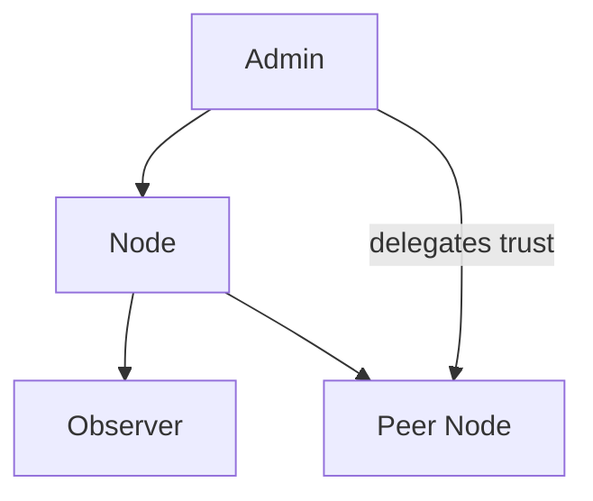

# truthctl CLI
Version: v0.4.0
Updated: 2025-01-18

Command-line utility for P2P synchronization and Truth Training node maintenance.

## Installation and Running

Build with client p2p functions:
```bash
cargo build --bin truthctl --features p2p-client-sync
```

## Main Commands

### Synchronization

Full synchronization with specific peer:
```bash
truthctl sync --peer http://127.0.0.1:8080 --identity keys/node1.json --mode full
```

Incremental synchronization:
```bash
truthctl sync --peer http://127.0.0.1:8080 --identity keys/node1.json --mode incremental
```

Synchronization with all known peers:
```bash
truthctl peers sync-all --mode full
truthctl peers sync-all --mode incremental --dry-run
```

### Node Status

```bash
truthctl status --db truth.db --identity keys/node1.json
```

Output includes:
- Node name and port (from `~/.truthctl/config.json`)
- Database path
- Number of peers (from `~/.truthctl/peers.json`)
- Last 5 sync records from `sync_logs` table
- For fresh database shows warning: "No sync history yet."
- Network metrics: average `propagation_priority`, average `relay_success_rate`, average `quality_index` with color coding (quality: 🔵 high, 🟡 medium, 🔴 low)

## Key Management

### Key Generation
```bash
truthctl keys generate
# output:
# private: <64-hex>
# public:  <64-hex>

# save to local storage (~/.truthctl/keys.json)
truthctl keys generate --save
```

### Key Import
```bash
truthctl keys import <priv_hex> <pub_hex>
truthctl keys list
```

## Node Initialization

Creating node configuration:
```bash
truthctl init-node <node_name> --port 8080 --db truth.db --auto-peer
```

Created files:
- `~/.truthctl/config.json`:
```json
{
  "node_name": "mynode",
  "port": 8080,
  "db_path": "truth.db",
  "public_key": "<hex>",
  "private_key": "<hex>"
}
```
- `~/.truthctl/peers.json` (with `--auto-peer`):
```json
{
  "peers": [
    { "url": "http://127.0.0.1:8080", "public_key": "<hex>" }
  ]
}
```

## Peer Management

### Adding and Viewing Peers
```bash
truthctl peers list
truthctl peers add http://127.0.0.1:8081 <pub_hex>
```

### Local Peer Statistics and History

Statistics (API `/api/v1/network/local`):

```bash
truthctl peers stats --server http://127.0.0.1:8080 --format table
truthctl peers stats --server http://127.0.0.1:8080 --format json
```

History from local DB (`peer_history`):

```bash
truthctl peers history --limit 50 --db truth.db
```

Example table:

```text
Peer                  Last Sync              Success  Fails  Quality  Trust
───────────────────────────────────────────────────────────────────────
http://peer-a:8080    2h ago                 12       1      0.88     0.92
http://peer-b:8080    1d ago                 5        2      0.75     0.80
───────────────────────────────────────────────────────────────────────
Avg success rate: 0.86 | Avg quality: 0.83
```

### Synchronization with All Peers
```bash
# Full bidirectional
truthctl peers sync-all --mode full

# Incremental
truthctl peers sync-all --mode incremental

# Dry run
truthctl peers sync-all --mode full --dry-run
```

### Authentication and Token Refresh

Token issuance (server should be listening, default `http://127.0.0.1:8080`):
```bash
truthctl auth --server http://127.0.0.1:8080 [--identity keys/node1.json]
```
Saves session to `~/.truthctl/session.json`:
```json
{
  "access_token": "<jwt>",
  "refresh_token": "<refresh>",
  "expires_at": 1710003600
}
```

Auto-refresh on expired token:
```bash
truthctl refresh --server http://127.0.0.1:8080
```
On successful refresh replaces token pair in `session.json`.

## RBAC: Users and Roles

List users (admin role):
```bash
truthctl users list --server http://127.0.0.1:8080
```

Role assignment:
```bash
truthctl users grant <pubkey> <role> --server http://127.0.0.1:8080
# role: admin | node | observer
```

Role revocation (convert to observer):
```bash
truthctl users revoke <pubkey> --server http://127.0.0.1:8080
```

## Trust Delegation

Delegate trust to target (requires role not lower than node):
```bash
truthctl trust delegate <target_pubkey> <delta> --server http://127.0.0.1:8080
# delta: small value in range [-0.2; 0.2], not to self
```

Role hierarchy and delegation (Mermaid):



## Configuration Management

Node configuration management (`~/.truthctl/config.json`):
```bash
truthctl config show
truthctl config set <key> <value>
truthctl config reset [--confirm]
```

Supported keys:
- `node_name`
- `port` (u16)
- `database` (DB path)
- `auto_peer` (boolean)
- `p2p_enabled` (boolean)

## Trust Propagation & Ratings

Viewing trust and changes:
```bash
truthctl ratings trust [--verbose]
```

- Local trust level — average `trust_score` from `node_ratings`
- Average network — `group_ratings.global.avg_score`
- In verbose mode shows change samples with color coding: 🟢 + (increase), 🔴 – (decrease), ⚪ = (no change)

Trust propagation mechanics (executed transparently during `/sync` and `/incremental_sync`):
- Blending formula: `new = local*0.8 + remote*0.2` (clamped to range [-1, 1])
- Time-based decay removed: no penalties for inactivity. Fairness for mobile/offline nodes ensured through `quality_index`.

## Adaptive Quality Evaluation & Propagation

- `quality_index` (0.0–1.0) — trust continuity indicator; doesn't penalize for offline.
- Local calculation: `q_raw = 0.5·relay_success_rate + 0.3·conflict_free_ratio + 0.2·trust_score_stability`, then EMA `q = 0.3·q_raw + 0.7·prev`.
- Network exchange and merging: `blend_quality(local, remote) = clamp(0.8·local + 0.2·remote, 0..1)`.
- CLI display:
- `truthctl status` prints average propagation priority (🔵/🟡/🔴), average relay and quality
- `truthctl graph show --format ascii` shows `propagation_priority` and `quality_index` for top nodes

## Logs

View and clear sync log:
```bash
truthctl logs show --limit 100 --db truth.db
truthctl logs clear --db truth.db
```

Columns: id, timestamp, peer_url, mode, status, details. Records created automatically after each `peers sync-all` attempt.

## Diagnostics and Reset

### Node State Check
```bash
truthctl diagnose [--verbose]
truthctl diagnose --server [--verbose]
```

Outputs:
- Local checks (`diagnostics.rs`): config, keys, peers, database and `p2p-client-sync` feature state. With `--verbose` prints JSON (`config`, `peers`, `keys`).
- With `--server` runs server checks from `truth_core::server_diagnostics`:
  - **API**: HTTP route `/health` availability
  - **Database**: ability to open SQLite and perform reads
  - **P2P**: UDP listener 37020 status (if enabled)

### Local Data Reset
```bash
truthctl reset-data [--confirm] [--reinit]
```

Steps through cleanup: removes SQLite DB, calls sync log cleanup, and on confirmation removes `~/.truthctl/peers.json`. Prints: `🧹 Node data cleared successfully.`

### Interactive Reinitialization

`--reinit` flag after cleanup:
- Checks for keypair in `~/.truthctl/keys.json`
- If none — generates Ed25519 and saves, outputting `🔑 New keypair generated.`
- If exists — prompts:
```
A keypair already exists.
Do you want to:
[1] Keep existing key
[2] Generate new key and replace old one
Enter choice [1/2]:
```
On choosing `[2]` generates and replaces pair (`🔁 Keypair replaced.`).

Then automatically executes:
```bash
truthctl init-node <node_name> --port <port> --db <db_path> --auto-peer
```
and prints `🚀 Node reinitialized successfully.`

## Notes
## HTTP API: New Endpoints for Mobile Integration

- GET `/api/v1/info` — returns node information:
  - `node_name`, `version`, `p2p_enabled`, `db_path`, `peer_count`

- GET `/api/v1/stats` — aggregated database statistics:
  - `events`, `statements`, `impacts`, `node_ratings`, `group_ratings`, `avg_trust_score`

OpenAPI documentation available at `/api/docs` (Swagger UI) and `/api/docs/openapi.json` (JSON).

Security note: CORS enabled for debugging (all origins, methods and headers allowed). In production, enable HTTPS and restrict CORS to trusted domains.

- `sync` and `verify` commands use first available key from local storage by default if explicit file not specified with `--identity` flag
- Key format — hex (32 bytes for private and public Ed25519 key)
- All commands support colored output for better readability
