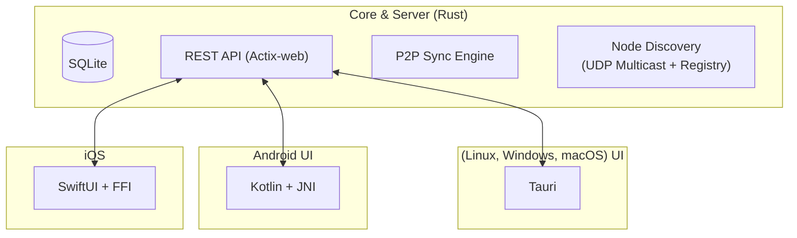

# Truth Training Architecture
Version: v1.0.0
Updated: 2025-01-XX

## 🔐 Privacy and Confidentiality

**Truth Training is built on the fundamental principle of confidentiality**: **No user actions are logged or persistently stored**. The application does not track, record, or save any user interactions, navigation patterns, clicks, or behavioral data. This ensures complete privacy and anonymity — users can interact with the system without leaving any trace of their actions.

**Architectural Privacy Guarantees:**
- ✅ **No User Action Logging**: Database schemas do not include tables for tracking user interactions
- ✅ **No Persistent User Tracking**: No identifiers, session data, or behavioral analytics are stored
- ✅ **No Telemetry Collection**: No user activity is transmitted or stored
- ✅ **Ephemeral Logs Only**: Only system-level logs (errors, sync operations) are temporarily stored for debugging purposes

This confidentiality principle is enforced across all platforms and is a core architectural requirement.

---

> **For comprehensive functional specifications, see:**
> - [spec/22-function_core.md](../spec/22-function_core.md) - Rust Core Modules
> - [spec/23-function_desktop.md](../spec/23-function_desktop.md) - Desktop UI
> - [spec/24-function_mobile_android.md](../spec/24-function_mobile_android.md) - Android Mobile

---

## 🔄 General Concept

**Truth Training** is a cross-platform platform whose core is implemented in **Rust**. The core handles:

* Data processing logic (events, contexts, expert system).
* Local storage (SQLite).
* API (REST/HTTP) for interaction with UI and other nodes.
* Synchronization module (P2P via UDP + HTTP).

UI shells for different platforms integrate with the core through FFI or HTTP API.

---

## 🔋 Repository Structure

```
core/                       # Core & Server: Rust + Actix-web + Sync Engine
app/                        # CLI Application
ui/desktop/                 # Desktop UI (Tauri)
truth-android-client/       # Android Client (Kotlin + JNI)
truth-ios-client/           # iOS Client (SwiftUI + FFI)
```

---

## 🔧 Core & Server (Rust)

* **Language:** Rust
* **Frameworks:** Actix-web, Tokio
* **Database:** SQLite (via `rusqlite`)
* **Location:** `core/` and main `src/` directories
* **Functions:**

  * Knowledge base management.
  * Event creation and processing (`truth_events`).
  * Expert system (lie detector).
  * Data synchronization via P2P.
  * HTTP API server functionality
  * **Node discovery and address exchange** (v1.0.0):
    - UDP multicast LAN/Wi-Fi discovery (`239.255.0.1:52525`)
    - Global registry polling (HTTPS)
    - HTTP reachability checks
    - TTL-driven cleanup
    - Deterministic merge rules (Local > Global priority)

---

## 🏗️ Architecture Pattern: Core-Server Separation

The Truth Training architecture implements a clear separation between the core library and server application:

**Core Library (`core/` directory):**
* Implemented as a Rust library crate (`core_lib`)
* Contains domain logic, data models, storage operations, and business rules
* Provides APIs for data processing, trust computation, and synchronization
* Used by multiple consumers (server, CLI, mobile via FFI)
* Independent of transport protocols or network communication

**Server Application (`src/` directory):**
* Implemented as a binary crate that depends on the core library
* Provides HTTP API using Actix-web framework
* Manages network communications, P2P discovery, and external integrations
* Handles authentication, request routing, and response formatting
* Runs as a standalone service with background tasks

This separation allows the core logic to be reused across different platforms and interfaces while keeping the server focused on network and API concerns.

---

## 🌐 UI Platforms
### **Desktop UI (ui/desktop)**

* **Technology:** Tauri (HTML + Rust backend).
* **Core connection:**

  * Via HTTP API (Actix).
  * Or direct function calls via crate (if installed locally).


### **Android (truth-android-client)**

**Language:** Kotlin + Room Database + WorkManager.
* **Core connection:**

  * Rust compiled to `.so` (via cargo-ndk) for cryptographic operations.
  * Room database with canonical SQLite schema matching Desktop/CLI.

### **Apple (iOS) (truth-ios-client)**

* **Language:** SwiftUI + Rust via FFI (`dylib`).
* **Core connection:**

  * Via FFI (calling Rust functions from Swift).
  * For iOS need Rust cross-compilation.

---

## 🖌 Mermaid Architecture Diagram



---

## Node Discovery and P2P Architecture (v1.0.0)

### Cross-Platform Discovery System

All platforms (Desktop, CLI, Server, Android, iOS) share a unified node discovery system:

**Discovery Channels:**
1. **UDP Multicast (LAN/Wi-Fi)**: Broadcasts on `239.255.0.1:52525`
   - JSON payload with ed25519 signatures
   - 30-second broadcast interval (LAN)
   - 45-second scan interval (Wi-Fi)
   - Self-announcement filtering

2. **Global Registry Polling**: HTTPS GET to registry endpoints
   - Supports envelope (`{nodes: [...]}`) and array formats
   - 1-hour polling interval
   - Configurable registry URLs

3. **Peer Sync**: HTTP POST to `/api/v1/nodes/sync`
   - Deterministic merge (Local > Global priority)
   - Bidirectional synchronization
   - Returns merged node list

**Platform Implementations:**

- **Desktop (Tauri)**: Background worker in `ui/desktop/src-tauri/src/discovery.rs`
  - Tokio interval-based discovery
  - Settings persistence
  - React UI integration (`NodesPanel.tsx`)
  - P2P functionality via HTTP API and UDP multicast
  - Direct database access through Rust core

- **CLI (truthctl)**: Commands in `app/src/bin/truthctl.rs`
  - `nodes list/add/remove/discover/sync/cleanup/health-check/validate`
  - Direct database access via `rusqlite`
  - Full command-line interface

- **Server**: HTTP API in `core/src/api.rs`
  - REST endpoints for node management
  - Background discovery workers
  - TTL cleanup scheduler
  - P2P synchronization via HTTP endpoints

- **Android**: Room + WorkManager in `truth-android-client/`
  - `LanDiscoveryClient` for UDP multicast (compatible with Rust implementation)
  - `DiscoveryRepository` for high-level operations
  - `NodeSyncWorker` for periodic sync via WorkManager (15-minute intervals)
  - `P2PDiscoveryService` for NSD-based peer discovery
  - Native core integration via `TruthCore.kt` (JNI bridge to Rust library)
  - P2P functionality via direct UDP multicast and HTTP sync
  - Compose UI (`NodesScreen.kt`)

- **iOS**: Swift + Core Data in `truth-ios-client/`
  - Bonjour/NSNetService for peer discovery
  - Core Data for local storage with SQLite backend
  - Native FFI integration with Rust core library
  - P2P functionality via Bonjour and HTTP sync

**Data Flow:**
```
UDP Multicast → Parse JSON → Verify Signature → Upsert to DB
Global Registry → HTTP GET → Parse JSON → Upsert to DB
Peer Sync → HTTP POST → Merge (Local > Global) → Return Merged List
```

### P2P Communication Patterns

The architecture supports multiple P2P communication patterns:

**Server-Mediated Communication:**
- Desktop and mobile applications can communicate indirectly through the server
- All nodes sync their data via HTTP endpoints exposed by the server
- Server acts as a relay and coordinator for network operations

**Direct P2P Communication:**
- Applications can communicate directly without server involvement
- Uses UDP multicast for node discovery on local networks
- Uses direct HTTP connections for data synchronization
- More resilient and reduces server dependency

**Hybrid Approach:**
- Applications use direct P2P when possible (local networks)
- Fall back to server-mediated communication when direct connection isn't feasible
- Provides both efficiency and reliability

**Reference Documentation:**
- [docs/cross_platform_discovery_compatibility.md](cross_platform_discovery_compatibility.md) - Format specifications
- [docs/android_discovery_architecture.md](android_discovery_architecture.md) - Android implementation details
- [specs/008-specify-md/contracts/README.md](https://github.com/ekwator/truth-training/blob/main/specs/008-specify-md/contracts/README.md) - Sync handshake contract

**Reference Documentation:**
- [docs/cross_platform_discovery_compatibility.md](cross_platform_discovery_compatibility.md) - Format specifications
- [docs/android_discovery_architecture.md](android_discovery_architecture.md) - Android implementation details
- [specs/008-specify-md/contracts/README.md](https://github.com/ekwator/truth-training/blob/main/specs/008-specify-md/contracts/README.md) - Sync handshake contract

## 📄 Documents

* **[architecture.md](architecture.md)** (current file) — module diagram and connections.
* **[ui_guidelines.md](ui_guidelines.md)** — UI integration rules with core.
* **[build_instructions.md](build_instructions.md)** — core and UI build instructions.
* **[cross_platform_discovery_compatibility.md](cross_platform_discovery_compatibility.md)** — Node discovery format compatibility.
* **[android_discovery_architecture.md](android_discovery_architecture.md)** — Android discovery implementation.
* **[CLI_Usage.md](CLI_Usage.md)** — truthctl command reference.
* **[Data_Schema.md](Data_Schema.md)** — Database schema documentation.