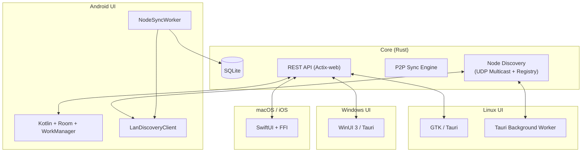

# Truth Training Architecture
Version: v1.0.0
Updated: 2025-01-XX

---

## 🔄 General Concept

**Truth Training** is a cross-platform platform whose core is implemented in **Rust**. The core handles:

* Data processing logic (events, contexts, expert system).
* Local storage (SQLite).
* API (REST/HTTP) for interaction with UI and other nodes.
* Synchronization module (P2P via UDP + HTTP).

UI shells for different platforms integrate with the core through FFI or HTTP API.

---

## 🔋 Repository Structure

```
truth-training/             # Core: Rust + Actix-web + Sync Engine
truth-training-unix/        # UI for Linux (GTK or Tauri)
truth-training-windows/     # UI for Windows (WinUI or Tauri)
truth-training-android/     # UI for Android (Kotlin + JNI)
truth-training-apple/       # UI for macOS and iOS (SwiftUI + FFI)
```

---

## 🔧 Core (Rust)

* **Language:** Rust
* **Frameworks:** Actix-web, Tokio
* **Database:** SQLite (via `rusqlite`)
* **Functions:**

  * Knowledge base management.
  * Event creation and processing (`truth_events`).
  * Expert system (lie detector).
  * Data synchronization via P2P.
  * **Node discovery and address exchange** (v1.0.0):
    - UDP multicast LAN/Wi-Fi discovery (`239.255.0.1:52525`)
    - Global registry polling (HTTPS)
    - HTTP reachability checks
    - TTL-driven cleanup
    - Deterministic merge rules (Local > Global priority)

---

## 🌐 UI Platforms

### **Linux (truth-training-unix)**

* **Options:** GTK (via `gtk-rs`) or Tauri (HTML + Rust backend).
* **Core connection:**

  * Via HTTP API (Actix).
  * Or direct function calls via crate (if installed locally).

### **Windows (truth-training-windows)**

* **Options:**

  * **WinUI 3** (C# + Rust DLL via FFI).
  * **Tauri** (universal approach).
* **Connection:**

  * Via HTTP API.
  * Or via DLL + FFI.

### **Android (truth-android-client)**

* **Language:** Kotlin + Room Database + WorkManager.
* **Core connection:**

  * Rust compiled to `.so` (via cargo-ndk) for cryptographic operations.
  * Room database with canonical SQLite schema matching Desktop/CLI.
  * **Node Discovery** (v1.0.0):
    - UDP multicast listener (`LanDiscoveryClient`)
    - Global registry polling via HTTP
    - Background sync via WorkManager (15-minute intervals)
    - UI integration via Jetpack Compose (`NodesScreen`)
    - Full feature parity with Desktop/CLI discovery

### **Apple (macOS/iOS) (truth-training-apple)**

* **Options:**

  * SwiftUI + Rust via FFI (`dylib`).
  * Or Tauri for macOS.
* **Connection:**

  * Via FFI (calling Rust functions from Swift).
  * For iOS need Rust cross-compilation.

---

## 📂 Integration and Updates

* All UI projects connect core as **Git submodule** or as **crate from crates.io**.
* Common documents (`docs/`) stored in `truth-training`.

---

## 🖌 Mermaid Architecture Diagram



---

## Node Discovery Architecture (v1.0.0)

### Cross-Platform Discovery System

All platforms (Desktop, CLI, Server, Android) share a unified node discovery system:

**Discovery Channels:**
1. **UDP Multicast (LAN/Wi-Fi)**: Broadcasts on `239.255.0.1:52525`
   - JSON payload with ed25519 signatures
   - 30-second broadcast interval (LAN)
   - 45-second scan interval (Wi-Fi)
   - Self-announcement filtering

2. **Global Registry Polling**: HTTPS GET to registry endpoints
   - Supports envelope (`{nodes: [...]}`) and array formats
   - 1-hour polling interval
   - Configurable registry URLs

3. **Peer Sync**: HTTP POST to `/api/v1/nodes/sync`
   - Deterministic merge (Local > Global priority)
   - Bidirectional synchronization
   - Returns merged node list

**Platform Implementations:**

- **Desktop (Tauri)**: Background worker in `ui/desktop/src-tauri/src/discovery.rs`
  - Tokio interval-based discovery
  - Settings persistence
  - React UI integration (`NodesPanel.tsx`)

- **CLI (truthctl)**: Commands in `app/src/bin/truthctl.rs`
  - `nodes list/add/remove/discover/sync/cleanup/health-check/validate`
  - Direct database access via `rusqlite`
  - Full command-line interface

- **Server**: HTTP API in `src/api.rs`
  - REST endpoints for node management
  - Background discovery workers
  - TTL cleanup scheduler

- **Android**: Room + WorkManager in `truth-android-client/`
  - `LanDiscoveryClient` for UDP multicast
  - `DiscoveryRepository` for high-level operations
  - `NodeSyncWorker` for periodic sync (15-minute intervals)
  - Compose UI (`NodesScreen.kt`)

**Data Flow:**
```
UDP Multicast → Parse JSON → Verify Signature → Upsert to DB
Global Registry → HTTP GET → Parse JSON → Upsert to DB
Peer Sync → HTTP POST → Merge (Local > Global) → Return Merged List
```

**Reference Documentation:**
- `docs/cross_platform_discovery_compatibility.md` - Format specifications
- `docs/android_discovery_architecture.md` - Android implementation details
- `specs/008-specify-md/contracts/README.md` - Sync handshake contract

## 📄 Documents

* **architecture.md** (current file) — module diagram and connections.
* **ui\_guidelines.md** — UI integration rules with core.
* **build\_instructions.md** — core and UI build instructions.
* **cross_platform_discovery_compatibility.md** — Node discovery format compatibility.
* **android_discovery_architecture.md** — Android discovery implementation.
* **CLI_Usage.md** — truthctl command reference.
* **Data_Schema.md** — Database schema documentation.