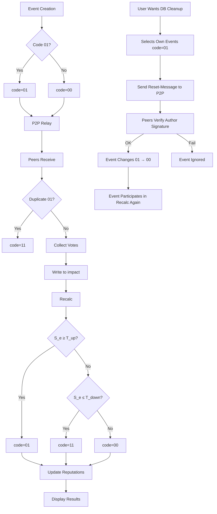

# Event Rating & Propagation Protocol
Version: v0.4.0
Updated: 2025-01-18  
**Truth Training** — event evaluation algorithm, reputation calculation and 8-bit message code behavior.

## Overview
- Each event (`truth_events`) stores 8-bit `code` field:
  - upper 2 bits — service code (00/01/10/11)
  - lower 6 bits — counter/metadata (0..63)
- Code `01` **simultaneously**:
  - means "permanent" event that gets relayed,
  - and is **originally** assigned by author on creation (author-assigned).
- Event evaluations stored in `impact` table (`value` field — boolean; `type_id` defines impact type: reputation, financial, moral, etc.).
- Algorithms compute: **event score** (event_score) and **user reputation** (user_reputation) based on `impact` history and validator weights.
- Code transition decisions (`00`→`01`, `01`→`00`, `01`→`11`) made automatically by metrics (thresholds).

---

## 1. Data Sources (used tables)
- `truth_events` — `code: u8` field (new).
- `impact` — subjective evaluation records:
  - `event_id` → `truth_events.id`
  - `type_id` → context/impact type
  - `value` → boolean (true = positive/confirmation, false = negative/refutation)
  - `notes`, `created_at`, `user_id` (validator identifier) — assumed `user_id` exists or validator identified cryptographically during sync.
- `progress_metrics` and aggregates — for storing final statistics at user and group level.

> Note: if `impact` doesn't have `user_id`/validator_id yet, need to record validator identifier (alias / public key) with each evaluation.

---

## 2. Calculation Goals
1. Convert evaluation set (`impact` records) to compact **event score** (`S_e`) in range `[-1, +1]` or `[0..1]`.
2. Based on `S_e`:
   - automatic code transition (e.g., `S_e >= T_up` → `01`, `S_e <= T_down` → `11`);
   - author reputation update (`R_author`);
   - validator credit/debit.
3. Ensure resistance to manipulation (Sybil, coordinated fake).

---

## 3. Main Concepts and Ranges
- `R_u` — user `u` reputation, normalized to `[0, 1]`.  
- `W_v` — validator `v` evaluation weight (function of `R_v` and activity `A_v`), `W_v >= 0`.  
- `vote` — evaluation value: `+1` (confirms) or `-1` (refutes).  
- `S_e` — final event score: weighted average by validators, normalized to `[-1,1]`.  
- Thresholds:
  - `T_up` — for transition to permanent (01), e.g. `0.75`.
  - `T_down` — for removal (11), e.g. `-0.6`.
  - `T_confirm` — for local confirmation/marking (10), e.g. `0.4`.

(threshold values — recommended starting values, adjust in tests and based on operation results)

---

## 4. Impact → Event Score (S_e) Transformation

### 4.1. Validator Weight
For validator `v` compute weight `W_v` — combined function of reputation and activity:
W_v = sigmoid( a * R_v + b * log(1 + A_v) )
- `R_v` — current reputation value (0..1).
- `A_v` — activity (number of evaluations per period), `log` smooths.
- `a, b` — coefficients (e.g. a=3, b=1).
- `sigmoid(x) = 1 / (1 + e^{-x})` → gives value in (0,1).

Can simplify: `W_v = R_v` (if not considering activity).

### 4.2. Single Vote Contribution
Let `vote_v ∈ {+1, -1}`. Validator contribution:
contrib_v = W_v * vote_v

### 4.3. Total Score
Sum over all validators, normalize by weight sum:
S_raw = Σ_v contrib_v
W_sum = Σ_v W_v
S_e = S_raw / W_sum // in range [-1, +1]
If `W_sum == 0` — `S_e = 0`.

### 4.4. Impact Type Consideration
If `impact.type_id` affects importance (reputation vs financial), can introduce `T_factor[type_id]` and multiply `contrib_v` by this factor.

---

## 5. Author and Validator Reputation Updates

### 5.1. Author Reputation Update `R_author`
Idea — use **Elo / gradient update** similarity:

- Assume author `u` has current reputation `R_u` (in [0,1]).  
- Expected result `E = f(R_u)` — e.g., `E = R_u` (expect high reputation author to be confirmed more often).  
- Actual result `O` — normalize `S_e` to `[0,1]`: `O = (S_e + 1)/2`.

Update:
Δ = K * (O - E)
R_u_new = clamp(R_u + Δ, 0.0, 1.0)
- `K` — learning rate (e.g., 0.05 or adaptive depending on event importance).

Example: author `R_u = 0.6`, `S_e = 0.8` → `O = 0.9`, `Δ = 0.05*(0.9-0.6)=0.015` → `R_u_new = 0.615`.

### 5.2. Validator Reward/Penalty
Each validator gets reward/penalty based on how their vote matched final `S_e` (or long-term result):

Agreement definition:
agree_v = (vote_v == sign(S_e)) ? 1 : -1
Where `sign(+0.2)=+1`, `sign(-0.4)=-1`, `sign(0)=0`. Can be smoother — use cosine distance:
score_v = 1 - abs( vote_v - S_e ) / 2
Then:
ΔR_v = K_v * W_global * (score_v - baseline)
where `K_v` — small coefficient (e.g. 0.01), `W_global` can consider case size.

Can award "credits" (internal score) instead of direct reputation change, then convert credits to reputation when reaching thresholds.

---

## 6. Threshold Rules and Code Transitions

### 6.1. Transitions (automatic)
- On regular `recalc` (locally or server) compute `S_e`.
- If `S_e >= T_up` and message was `00` → mark `01` (permanent).  
  - Also mark `author` for accuracy (observe `R_author` increase).
- If `S_e < T_up` but `code == 01` and N days passed since assignment without support → can downgrade back to `00` (soft rollback).
- If `S_e <= T_down` → mark `11` (removed).  
  - On hitting `11` — validators who voted for lies get penalties (considering weight).
- `10` used as local verification mark:  
  - On node receipt: if same `01` exists in local DB — mark and forward as `11` (see original protocol).

### 6.2. Forwarding Behavior
- When forwarding decrease lower 6 bits counter (if code 00 and counter>0) — when 0 → stop forwarding.  
- When forwarding `01` — on send can temporarily change to `00` (as in your protocol) to control propagation (or don't change — architectural decision).

---

## 7. Attack Protection (Sybil, coordinated lies)
- **Validator identification**: each node has key pair (public key = alias). Each evaluation signed (signature) — can verify authenticity during sync.
- **New node strength limitation**: starting weight `W_v` for new users low; weight growth only through long positive behavior (long verification).
- **Anomaly/convergence detector**: if group small and all votes same and sharply change `S_e`, suspicion metrics grow — system reduces these vote weights, requires more confirmations.
- **Crowdsourced verification**: combine automatic metrics with manual verification capability (trusted validators / experts).
- **Deterrence coefficient**: penalties for frequent contradictory voting, especially from accounts with same IP/behavioral patterns (can track locally).

---

## 8. Aggregate Storage and Recalc Frequency
- **Implement periodic `recalc` task** (locally and/or server during sync) that:
  1. For each `truth_event` collects `impact` (for given window).
  2. Computes `S_e`.
  3. Applies code rules (transitions).
  4. Computes `ΔR` for author and validators.
  5. Writes aggregates to `progress_metrics` (and optionally to `truth_events.event_score`).
- `recalc` frequency: in small network — more often (every few minutes). In large — less often (hour/day) + trigger on new votes.

---

## 9. Example (numerical)
- Validators: `v1 (R=0.8)`, `v2 (R=0.3)`, `v3 (R=0.6)`.
- Votes: `v1:+1`, `v2:+1`, `v3:-1`.
- Let `W_v = R_v` (simplified).  
  - `S_raw = 0.8*1 + 0.3*1 + 0.6*(-1) = 0.5`
  - `W_sum = 0.8 + 0.3 + 0.6 = 1.7`
  - `S_e = 0.5 / 1.7 ≈ 0.294` → weak support.
- If `T_up=0.75`, event remains `00`.  
- Author gets `O = (S_e+1)/2 ≈ 0.647`, expectation `E=R_author` → update `R_author`.

---

## 10. Practical Integration into Current Schema
- **Minimal DB changes**:
  - add `code INTEGER` (1 byte) field to `truth_events`.
  - add/clarify `impact.user_id` (validator id) when inserting votes.
- **Computations**:
  - `recalc` uses `SELECT impact.* WHERE event_id = X` → aggregates.
  - results write to `progress_metrics` (user & group aggregates) and optionally to `truth_events.event_score`.
- **In P2P sync**:
  - on receiving new `impact` from peer — award temporary points, but final reputation change apply only after local `recalc` (to avoid races).
  - during sync nodes exchange aggregates (event_score) and signatures, helps quick convergence.
  - node trust propagation executed transparently: `trust_score_new = trust_local*0.8 + trust_remote*0.2` clamped to [-1,1]; when `last_updated > 7 days` apply decay ×0.9.

---

## 11. Parameter Recommendations and Initial Setup
- `a=3, b=1` in `W_v` (weights), `K=0.03` for `R_author` update, `K_v=0.01` for validators.
- `T_up = 0.75`, `T_down = -0.6`, `T_confirm = 0.4`.
- Test in network simulations for adjustment.

---

## 12. Conclusion
Algorithm:
- easily integrates into current structure (add `code: u8` and `impact.user_id` if needed);
- combines decentralized relay with local trust calculation;
- provides incentive and punishment mechanisms, helps reduce fraud value;
- requires Sybil attack protection — through gradual new node weight growth, signatures and anomaly detection.

## 13. User Database Cleanup (event reset)
User can mark own verified events as unverified, transitioning their code `01 → 00`.  
This allows reviewing old claims, initiating re-verification or local database cleanup.  

- Available only to event author (confirmed by signature).  
- Propagated as separate "reset-message".  
- All nodes receiving message change specified event code `01` to `00`.  
- Frequency limitation protects network from abuse.  

## 14. Process Workflow Diagram

