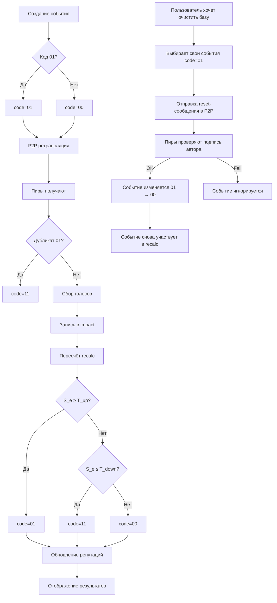

# Event Rating & Propagation Protocol  
**Truth Training** — алгоритм оценки событий, расчёта репутации и поведения 8-битного кода сообщения.

## Кратко
- Каждое событие (`truth_events`) хранит 8-битное поле `code`:
  - старшие 2 бита — служебный код (00/01/10/11)
  - младшие 6 бит — счётчик/метаинформация (0..63)
- Код `01` **одновременно**:
  - означает «постоянное» событие, которое ретранслируется,
  - и **исходно** присваивается автору при создании (author-assigned).
- Оценки события хранятся в таблице `impact` (поле `value` — boolean; `type_id` определяет тип влияния: репутация, финансы, мораль и т.п.).
- Алгоритмы вычисляют: **оценку события** (event_score) и **репутацию пользователя** (user_reputation) на основе истории `impact` и весов валидаторов.
- Решения о переводе кодов (`00`→`01`, `01`→`00`, `01`→`11`) принимаются автоматически по метрикам (порогам).

---

## 1. Источники данных (используемые таблицы)
- `truth_events` — поле `code: u8` (новое).
- `impact` — строки фиксации субъективных оценок:
  - `event_id` → `truth_events.id`
  - `type_id` → контекст/тип влияния
  - `value` → boolean (true = позитивно/подтверждение, false = негативно/опровержение)
  - `notes`, `created_at`, `user_id` (идентификатор валидатора) — предполагается, `user_id` уже есть или валидатор идентифицируется криптографически при синхронизации.
- `progress_metrics` и агрегаты — для хранения итоговой статистики на уровне пользователя и группы.

> Примечание: если в `impact` ещё нет `user_id`/validator_id, нужно записывать идентификатор валидатора (псевдоним / публичный ключ) вместе с каждой оценкой.

---

## 2. Цели расчёта
1. Преобразовать набор оценок (`impact` записей) в компактную **оценку события** (`S_e`) в диапазоне `[-1, +1]` или `[0..1]`.
2. На основе `S_e`:
   - автоматический перевод кода (например, `S_e >= T_up` → `01`, `S_e <= T_down` → `11`);
   - обновление репутации автора (`R_author`);
   - начисление/списание кредитов валидаторам.
3. Обеспечить устойчивость к манипуляциям (Sybil, координированный фэйк).

---

## 3. Основные понятия и диапазоны
- `R_u` — репутация пользователя `u`, нормализованная в `[0, 1]`.  
- `W_v` — вес оценки валидатора `v` (функция от `R_v` и активности `A_v`), `W_v >= 0`.  
- `vote` — значение оценки: `+1` (подтверждает) или `-1` (опровергает).  
- `S_e` — итоговый скор события: взвешенное среднее по валидаторам, нормализовано в `[-1,1]`.  
- Пороги:
  - `T_up` — для перехода в постоянные (01), например `0.75`.
  - `T_down` — для удаления (11), например `-0.6`.
  - `T_confirm` — для локального подтверждения / отметки (10), например `0.4`.

(пороговые значения — рекомендованные стартовые, менять в тестах и по результатам эксплуатации)

---

## 4. Преобразование impact → event_score (S_e)

### 4.1. Вес валидатора
Для валидатора `v` вычисляем вес `W_v` — комбинированная функция репутации и активности:
W_v = sigmoid( a * R_v + b * log(1 + A_v) )
- `R_v` — текущее значение репутации (0..1).
- `A_v` — активность (кол-во оценок за период), `log` сглаживает.
- `a, b` — коэффициенты (например a=3, b=1).
- `sigmoid(x) = 1 / (1 + e^{-x})` → даёт значение в (0,1).

Можно упростить: `W_v = R_v` (если активность не учитываем).

### 4.2. Вклад одного голоса
Пусть `vote_v ∈ {+1, -1}`. Вклад валидатора:
contrib_v = W_v * vote_v

### 4.3. Суммарный скор
Суммируем по всем валидаторам, нормируем на сумму весов:
S_raw = Σ_v contrib_v
W_sum = Σ_v W_v
S_e = S_raw / W_sum // в диапазоне [-1, +1]
Если `W_sum == 0` — `S_e = 0`.

### 4.4. Учет типа влияния
Если `impact.type_id` влияет на важность (репутация vs финансы), можно вводить `T_factor[type_id]` и умножать `contrib_v` на этот множитель.

---

## 5. Обновление репутации автора и валидаторов

### 5.1. Обновление репутации автора `R_author`
Идея — использовать подобие **Elo / градиентного обновления**:

- Предположим, у автора `u` есть текущая репутация `R_u` (в [0,1]).  
- Ожидаемый результат `E = f(R_u)` — например, `E = R_u` (ожидаем, что автор с высокой репутацией будет чаще подтверждён).  
- Фактический результат `O` — нормализуем `S_e` в `[0,1]`: `O = (S_e + 1)/2`.

Обновление:
Δ = K * (O - E)
R_u_new = clamp(R_u + Δ, 0.0, 1.0)
- `K` — learning rate (напр., 0.05 или адаптивный в зависимости от важности события).

Пример: автор `R_u = 0.6`, `S_e = 0.8` → `O = 0.9`, `Δ = 0.05*(0.9-0.6)=0.015` → `R_u_new = 0.615`.

### 5.2. Вознаграждение/штраф валидаторов
Каждый валидатор получает награду/штраф на основе того, насколько его голос совпал с итоговым `S_e` (или с долгосрочным результатом):

Определение соответствия:
agree_v = (vote_v == sign(S_e)) ? 1 : -1
Где `sign(+0.2)=+1`, `sign(-0.4)=-1`, `sign(0)=0`. Можно более плавно — использовать косинусное расстояние:
score_v = 1 - abs( vote_v - S_e ) / 2
А затем:
ΔR_v = K_v * W_global * (score_v - baseline)
где `K_v` — маленький коэффициент (например 0.01), `W_global` может учитывать размер дела.

Можно начислять «кредиты» (внутренний счёт) вместо прямого изменения репутации, и затем конвертировать кредиты в репутацию при достижении порогов.

---

## 6. Пороговые правила и перевод кодов

### 6.1. Переходы (автоматические)
- На регулярном `recalc` (локально или на сервере) вычисляем `S_e`.
- Если `S_e >= T_up` и сообщение было `00` → пометить `01` (постоянное).  
  - Также пометь `author` за выверенность (наблюдаем прирост `R_author`).
- Если `S_e < T_up` но `code == 01` и с момента назначения прошло N дней без поддержки → можно понизить обратно в `00` (soft rollback).
- Если `S_e <= T_down` → пометить `11` (удалено).  
  - При попадании в `11` — валидаторы, голосовавшие за ложь, получают штрафы (с учётом веса).
- `10` используется как локальная пометка проверки:  
  - При приёме узлом: если есть такой же `01` в локальной БД — помечаем и пересылаем как `11` (см. исходный протокол).

### 6.2. Поведение при пересылке
- При пересылке уменьшать младшие 6 бит счётчика (если код 00 и счётчик>0) — когда 0 → перестать пересылать.  
- При пересылке `01` — при отправке можно временно поменять на `00` (как в твоём протоколе), чтобы контролировать распространение (или не менять — решение архитектурное).

---

## 7. Защита от атак (Sybil, координированная ложь)
- **Идентификация валидатора**: каждый узел имеет ключевую пару (публичный ключ = псевдоним). Каждая оценка подписывается (signature) — при синхронизации можно проверить подлинность.
- **Ограничение силы новых нод**: стартовый вес `W_v` для новых пользователей низкий; рост веса только через длительное позитивное поведение (длительная верификация).
- **Аномалия/детектор сходимости**: если группа малочисленна, а все голоса одинаковы и резко меняют `S_e`, метрики подозрительности растут — система снижает вес этих голосов, требует больше подтверждений.
- **Краудсорсинговая проверка**: комбинировать автоматические метрики с возможностью ручной проверки (trusted validators / experts).
- **Коэффициент сдерживания**: штрафы за частые противоречивые голосования, особенно от аккаунтов с одинаковыми IP/поведенческими паттернами (локально можно отслеживать).

---

## 8. Хранение агрегатов и частота пересчёта
- **Реализовать периодическую задачу `recalc`** (локально и/или на сервере при синхронизации), которая:
  1. Для каждого `truth_event` собирает `impact` (за заданный window).
  2. Вычисляет `S_e`.
  3. Применяет правила кодов (переводы).
  4. Вычисляет `ΔR` для автора и валидаторов.
  5. Записывает агрегаты в `progress_metrics` (и, опционально, в `truth_events.event_score`).
- Частота `recalc`: при малой сети — чаще (каждые несколько минут). При большой — реже (час/сутки) + триггер по новым голосам.

---

## 9. Пример (числовой)
- Валидаторы: `v1 (R=0.8)`, `v2 (R=0.3)`, `v3 (R=0.6)`.
- Голоса: `v1:+1`, `v2:+1`, `v3:-1`.
- Пусть `W_v = R_v` (упрощённо).  
  - `S_raw = 0.8*1 + 0.3*1 + 0.6*(-1) = 0.5`
  - `W_sum = 0.8 + 0.3 + 0.6 = 1.7`
  - `S_e = 0.5 / 1.7 ≈ 0.294` → слабая поддержка.
- Если `T_up=0.75`, событие остаётся `00`.  
- Автор получает `O = (S_e+1)/2 ≈ 0.647`, ожидание `E=R_author` → обновляем `R_author`.

---

## 10. Практическое встраивание в текущую схему
- **Минимальные изменения DB**:
  - добавить поле `code INTEGER` (1 байт) в `truth_events`.
  - добавить/уточнить `impact.user_id` (validator id) при вставке голосов.
- **Вычисления**:
  - `recalc` использует `SELECT impact.* WHERE event_id = X` → агрегирует.
  - результаты записывать в `progress_metrics` (user & group aggregates) и при желании в `truth_events.event_score`.
- **В P2P-синхронизации**:
  - при получении нового `impact` от пира — начислить временные очки, но окончательное изменение репутации применять только после локального `recalc` (чтобы избежать гонок).
  - при синхронизации узлы передают агрегаты (event_score) и подписи, что помогает быстро конвергировать.
  - распространение доверия узлов выполняется прозрачно: `trust_score_new = trust_local*0.8 + trust_remote*0.2` с ограничением в [-1,1]; при давности `last_updated > 7 дней` применяется спад ×0.9.

---

## 11. Рекомендации по параметрам и начальной настройке
- `a=3, b=1` в `W_v` (веса), `K=0.03` для обновления `R_author`, `K_v=0.01` для валидаторов.
- `T_up = 0.75`, `T_down = -0.6`, `T_confirm = 0.4`.
- Тестировать в симуляциях сети для корректировки.

---

## 12. Заключение
Алгоритм:
- легко встраивается в текущую структуру (добавляем `code: u8` и `impact.user_id` если необходимо);
- комбинирует децентрализованную ретрансляцию с локальным расчётом доверия;
- даёт механизмы стимулов и наказаний, что помогает снижать ценность мошенничества;
- требует защиты от Sybil-атак — через постепенный рост веса новых узлов, подписи и аномал-детект.

## 13. Очистка базы пользователем (reset событий)
Пользователь может отметить собственные проверенные события как непроверенные, переводя их код `01 → 00`.  
Это позволяет пересматривать старые утверждения, инициировать повторную проверку или очистку локальной базы.  

- Доступно только автору события (подтверждается подписью).  
- Распространяется как отдельное «reset-сообщение».  
- Все узлы, получившие сообщение, меняют у указанного события код `01` на `00`.  
- Ограничение по частоте защищает сеть от злоупотреблений.  

## 14. Схема работы процесса

