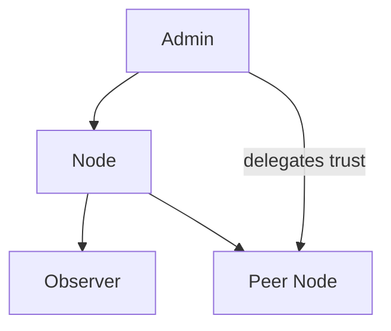
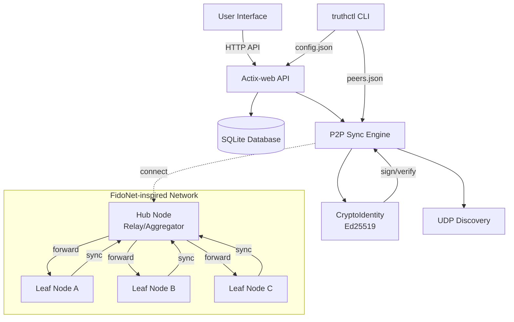
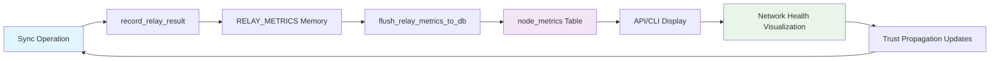

## Architecture Overview

This document reflects the current `truth-core` implementation and the CLI utilities, inspired by FidoNet principles for decentralized peer-to-peer communication.

### FidoNet-Inspired Network Model

**Core Principles:**
- **Store-and-forward**: Nodes store data locally and synchronize on schedule or on-demand
- **Hub/Leaf roles**: Leaf nodes (edge) connect to hub nodes (relay/aggregator) for data propagation
- **Trust propagation**: Reputation spreads through the network via signed endorsements and delegated adjustments (admin → node → observer)

### Role Hierarchy and Trust Delegation

Roles define permissions across API and peer actions:

- admin: full control (manage users/roles, network operations)
- node: authenticated node, can delegate trust within limits
- observer: read-only access

Delegation and hierarchy:

- admin → node → observer: higher roles imply lower ones
- nodes may delegate small trust deltas to peers (bounded and audited)

Mermaid diagram:

- **Zone addressing**: Nodes can be addressed as `Zone:Net/Node` for hierarchical routing
- **Delayed sync**: Nodes may be offline and sync when reconnected

**Node Behavior:**
- **Isolated nodes**: Can operate independently and sync when peers become available
- **Late synchronization**: Nodes can reconstruct missing data via peer replication
- **Forward-ack exchange**: Nodes acknowledge receipt and forward data to other peers
- **Peer etiquette**: Respectful sync intervals, avoid overwhelming peers

### Functional Separation

- **truth-core**: core logic, P2P, crypto, and DB access (library only, no user I/O).
- **app (truthctl)**: administrative CLI that uses truth-core as a dependency.
- **server**: network node (HTTP + P2P) that provides API endpoints.

### Network Health Visualization

**Real-time Metrics:**
- **Propagation Priority**: Node's relay speed (0.0-1.0) based on trust and activity
- **Relay Success Rate**: Percentage of successful message deliveries
- **Latency Metrics**: Average response times between nodes
- **Trust Scores**: Node reputation and validation history

**Visualization Formats:**
- **JSON API**: `/graph/json` with propagation_priority, relay_success_rate, latency_ms
- **ASCII Graph**: CLI `truthctl graph show --format ascii` for terminal display
- **Network Stats**: `/api/v1/stats` with aggregated trust, propagation, and relay metrics

**Filtering Options:**
- `min_priority`: Filter nodes by minimum propagation priority
- `limit`: Maximum number of nodes to display
- `min_score`: Filter by minimum trust score

### Mobile Client Integration

- API versioning: public client-facing endpoints are namespaced under `/api/v1/...`.
- Android apps can consume the node via Retrofit using the emulator loopback `http://10.0.2.2:8080/`.
- OpenAPI documentation is exposed at `/api/docs` (Swagger UI) and `/api/docs/openapi.json` (JSON spec).
- CORS: for development builds, CORS is wide open to simplify mobile debugging. In production, restrict origins and require HTTPS.

New endpoints for v1:
- `GET /api/v1/info` — basic node info: `node_name`, `version`, `p2p_enabled`, `db_path`, `peer_count`.
- `GET /api/v1/stats` — database stats: counts for `events`, `statements`, `impacts`, `node_ratings`, `group_ratings`, and average `trust_score`.

This separation ensures modular testing, clean builds, and independent versioning.

### Responsibilities

- Data logic and storage (SQLite via rusqlite).
- REST API (actix-web) for local UI and peer interop.
- P2P synchronization and peer discovery.
- Ed25519 signing/verification for sync endpoints.
- Trust propagation and reputation management.

### Modules

- **core-lib**: models, storage (schema + ops), expert heuristics.
- **api**: HTTP routes in `src/api.rs` (health, init/seed, events/statements, impacts, progress, get_data, sync, incremental_sync, ratings, graph) with signature verification helpers. Server health checks for API/DB/P2P are exposed via `truth_core::server_diagnostics` and can be invoked from CLI.
- **p2p**: sync flows and reconciliation in `src/p2p/sync.rs`, periodic node loop in `src/p2p/node.rs`.
- **trust layer**: `core-lib/src/trust_propagation.rs` реализует смешивание доверия (local*0.8 + remote*0.2). Временной спад (time-based decay) удалён для справедливости мобильных/оффлайн узлов. Добавлен `quality_index` (0.0–1.0) как индикатор непрерывности: локально считается по адаптивной формуле с EMA, по сети распространяется через `blend_quality(local, remote)`.
- **p2p/encryption**: `CryptoIdentity` (Ed25519) with hex helpers and Result-based verify; header message patterns.
- **net**: UDP beacon sender/listener in `src/net.rs` for LAN peer discovery.
- **app/truthctl**: peer registry (`peers.json`), `peers add/list`, and `sync` orchestration (push or pull-only).
- **sync logs**: persistent high-level sync logs in `core-lib/src/storage.rs` (table `sync_logs`), exposed via CLI `truthctl logs show|clear`.
- **node configuration**: user-editable `~/.truthctl/config.json` managed via `truthctl config` (show/set/reset).
- **status summary**: `truthctl status` aggregates configuration, peers, and recent `sync_logs` to report node health. For runtime checks, `truthctl diagnose --server` probes `/health`, opens SQLite, and inspects P2P listener status.
- **self-healing init**: `truthctl reset-data [--reinit]` clears local state and can reinitialize node automatically, including key generation/replacement and `init-node` invocation.

### Non-goals (MVP)

- Reputation/Sybil resistance; validator weighting; global propagation semantics.
- Trust layer intentionally simple (blend + decay), applied transparently during `/sync` and `/incremental_sync`.

### Architecture Diagram

### Relay Feedback Loop

The system implements a dynamic relay feedback loop for network health monitoring:

