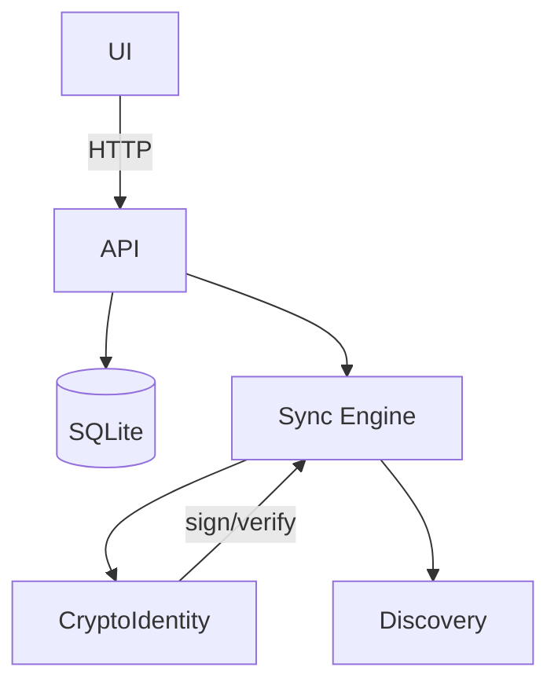

## Architecture Overview

See `docs/architecture.md` for module layout and mermaid diagrams.

Core responsibilities
- Data logic and storage (SQLite via rusqlite).
- REST API (actix-web) for UI/peers.
- P2P sync and discovery.

Modules
- core-lib: models, storage (schema + ops), expert heuristics.
- server (workspace root): API (`src/api.rs`), P2P sync (`src/p2p/*`), encryption (`src/p2p/encryption.rs`), HTTP server.
- app: CLI tools — legacy demo and `truthctl` for peers and sync.

Non-goals (MVP)
- Full reputation and Sybil-resistance; advanced propagation semantics.

Mermaid overview

