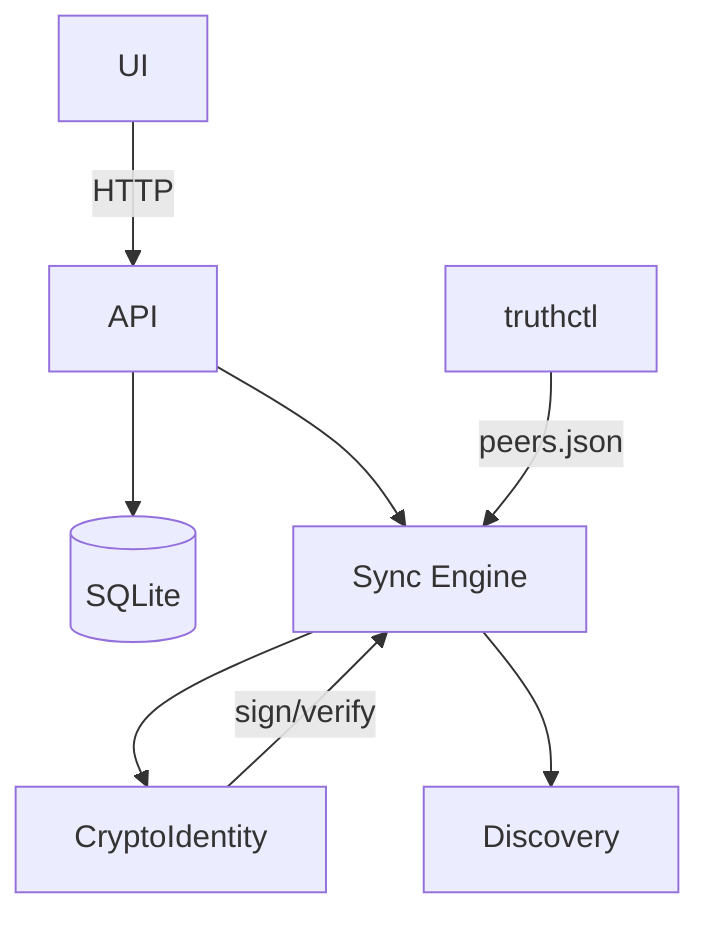

## Architecture Overview

This document reflects the current `truth-core` implementation and the CLI utilities.

### Functional Separation

- **truth-core**: core logic, P2P, crypto, and DB access (library only, no user I/O).
- **app (truthctl)**: administrative CLI that uses truth-core as a dependency.
- **server**: network node (HTTP + P2P) that provides API endpoints.

This separation ensures modular testing, clean builds, and independent versioning.

Responsibilities
- Data logic and storage (SQLite via rusqlite).
- REST API (actix-web) for local UI and peer interop.
- P2P synchronization and peer discovery.
- Ed25519 signing/verification for sync endpoints.

Modules
- core-lib: models, storage (schema + ops), expert heuristics.
- api: HTTP routes in `src/api.rs` (health, init/seed, events/statements, impacts, progress, get_data, sync, incremental_sync) with signature verification helpers.
- p2p: sync flows and reconciliation in `src/p2p/sync.rs`, periodic node loop in `src/p2p/node.rs`.
- p2p/encryption: `CryptoIdentity` (Ed25519) with hex helpers and Result-based verify; header message patterns.
- net: UDP beacon sender/listener in `src/net.rs` for LAN peer discovery.
- app/truthctl: peer registry (`peers.json`), `peers add/list`, and `sync` orchestration (push or pull-only).
- sync logs: persistent high-level sync logs in `core-lib/src/storage.rs` (table `sync_logs`), exposed via CLI `truthctl logs show|clear`.

Non-goals (MVP)
- Reputation/Sybil resistance; validator weighting; global propagation semantics.

Overview

