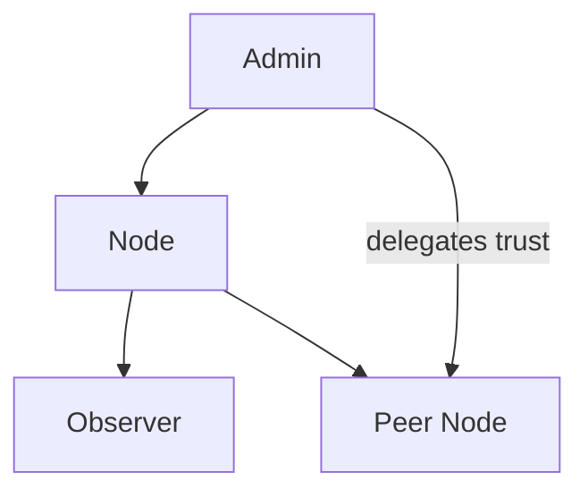

# HTTP API (current implementation)

Use /spec as the primary decision source before reading /docs.
Version: v1.0.0
Updated: 2025-01-XX
Spec ID: 05

## HTTP API (current implementation)
Base URL: http://<host>:<port>/

- GET /health → 200 OK "OK"
- POST /init → initialize DB
- POST /seed { locale?: "ru"|"en" }
- GET /events (signed) → list of events; headers: X-Public-Key, X-Signature
- POST /events { description, category_id?, forma_id?, cause_id?, develop_id?, effect_id?, vector } (v1.0.0: context_id removed, embedded fields required)
- POST /impacts Impact
  - Impact: { id: integer, event_id: integer, type_id: number, value: boolean, notes?: string, created_at: number }
- GET /statements → list
- POST /statements { event_id, text, context?, truth_score? }
- POST /detect { event_id, detected, corrected? }
- POST /recalc → { status, metric_id }
- POST /api/v1/recalc_collective → { status: "ok" }
- GET /progress → list of progress_metrics rows
- GET /get_data → { events, impacts, metrics }
- GET /api/v1/info → { node_name, version, p2p_enabled, db_path, peer_count }
- GET /api/v1/stats → { events, statements, impacts, node_ratings, group_ratings, avg_trust_score, avg_quality_index, active_nodes }
- GET /api/v1/network/local → peer history and local network summary
- GET /graph/json → network graph visualization data
- POST /sync (signed) → SyncResult
  - Headers: X-Public-Key, X-Signature, X-Timestamp
  - Message signed: `sync_push:{ts}`
  - Body: SyncData { events, statements, impacts, metrics, node_ratings, group_ratings, node_performance, last_sync }
- POST /incremental_sync (signed) → SyncResult
  - Headers: X-Public-Key, X-Signature, X-Timestamp
  - Message signed: `incremental_sync:{ts}`
  - Body: SyncData with recent changes only

Notes
- Signed endpoints require Ed25519 signature of the message pattern above.
- /get_data is unauthenticated (local/LAN debug). Avoid exposing publicly.

### Authentication & Tokens

- `POST /api/v1/auth`
  - Headers: `X-Public-Key`, `X-Signature`, `X-Timestamp`
  - Message to sign: `auth:{ts}`
  - Response 200:
    ```json
  { "access_token": "<jwt>", "refresh_token": "<refresh>", "token_type": "Bearer", "expires_in": 3600 }
    ```
  - 401: `{ "error": "unauthorized", "code": 401 }`

- `POST /api/v1/refresh`
  - Body: `{ "refresh_token": "<refresh>" }`
  - Response 200: same as auth (rotated refresh)
  - 401 on invalid/expired refresh

Protected endpoints (require header `Authorization: Bearer <jwt>`):
- `POST /api/v1/recalc`
- `POST /api/v1/ratings/sync`
- `POST /api/v1/reset`
- `POST /api/v1/reinit`

### RBAC and Trust Delegation

- `GET /api/v1/users` (admin only)
  - Returns: array of `RbacUser` with `pubkey`, `role` (`admin|node|observer`), `trust_score`

- `POST /api/v1/users/role` (admin only)
  - Body: `{ "pubkey": "<hex>", "role": "admin|node|observer" }`
  - Sets role or creates user if absent.

- `POST /api/v1/trust/delegate` (role >= node)
  - Body: `{ "target_pubkey": "<hex>", "delta": 0.1 }` (|delta| ≤ 0.2, not self)
  - Adjusts target trust score locally; propagated via ratings sync.

Role hierarchy (implied permissions): `admin → node → observer`.

Mermaid:


```mermaid
graph TD
    A["Admin"] --> B["Node"]
    B --> C["Observer"]
    B --> D["Peer Node"]
    A -->|"delegates trust"| D
```

JWT Claims include role and trust_score:
```json
{
  "sub": "<pubkey>",
  "exp": 1710003600,
  "iat": 1710000000,
  "role": "node",
  "trust_score": 0.42
}
```

### Context Template API (v1.0.0)

- `GET /contexts` → list all context templates
- `POST /contexts` → create context template (with duplicate detection, returns 409 Conflict if duplicate)
  - Body: `{ name, category_id?, forma_id?, cause_id?, develop_id?, effect_id?, description? }`
- `GET /contexts/by-name/{name}` → get template by name
- `POST /contexts/match` → match event fields to template
  - Body: `{ category_id?, forma_id?, cause_id?, develop_id?, effect_id? }`
  - Returns: `{ matched: boolean, template: ContextTemplate | null }`
- `POST /contexts/from-event` → create template from event
  - Body: `{ name, event_id, description? }`

Future alignment
- Consider consolidating GET /events and GET /get_data, and adding pagination.
- OpenAPI documentation available at `/api/docs` (Swagger UI) and `/api/docs/openapi.json` (JSON spec).

### JSON Schemas (informal)

TruthEvent (v1.0.0: embedded context fields)
```json
{
  "id": 1,
  "description": "string",
  "category_id": 1,
  "forma_id": 2,
  "cause_id": 3,
  "develop_id": 4,
  "effect_id": 5,
  "vector": true,
  "detected": null,
  "corrected": false,
  "timestamp_start": 1710000000,
  "timestamp_end": null,
  "code": 1,
  "signature": "hex|null",
  "public_key": "hex|null",
  "collective_score": 0.75
}
```
Note: All context fields (category_id, forma_id, cause_id, develop_id, effect_id) are nullable. The `context_id` field has been removed in v1.0.0.

Statement
```json
{
  "id": 1,
  "event_id": 1,
  "text": "string",
  "context": "string|null",
  "truth_score": 0.5,
  "created_at": 1710000000,
  "updated_at": 1710000000,
  "signature": "hex|null",
  "public_key": "hex|null"
}
```

Impact
```json
{
  "id": 1,
  "event_id": 1,
  "type_id": 1,
  "value": true,
  "notes": "string|null",
  "created_at": 1710000000,
  "signature": "hex|null",
  "public_key": "hex|null"
}
```
Note: `id` is INTEGER (PK, AUTOINCREMENT), not UUID.

ProgressMetrics
```json
{
  "id": 1,
  "timestamp": 1710000000,
  "total_events": 10,
  "total_events_group": 10,
  "total_positive_impact": 1.0,
  "total_positive_impact_group": 1.0,
  "total_negative_impact": 0.0,
  "total_negative_impact_group": 0.0,
  "trend": 1.0,
  "trend_group": 1.0
}
```

SyncData
```json
{
  "events": [/* TruthEvent[] */],
  "statements": [/* Statement[] */],
  "impacts": [/* Impact[] */],
  "metrics": [/* ProgressMetrics[] */],
  "node_ratings": [/* NodeRating[] */],
  "group_ratings": [/* GroupRating[] */],
  "node_performance": [/* NodeMetrics[]; includes relay_success_rate, quality_index, propagation_priority */],
  "last_sync": 1710000000
}
```

SyncResult
```json
{
  "conflicts_resolved": 0,
  "events_added": 0,
  "statements_added": 0,
  "impacts_added": 0,
  "errors": ["string"],
  "nodes_trust_changed": 0,
  "trust_diff": [{"node_id":"hex","delta":0.1}],
  "avg_quality_index": 0.82
}
```

_Version: v1.0.0_

- See [docs/README.md](../docs/README.md) for detailed explanations.

- See [spec/README.md](README.md) for detailed explanations.
