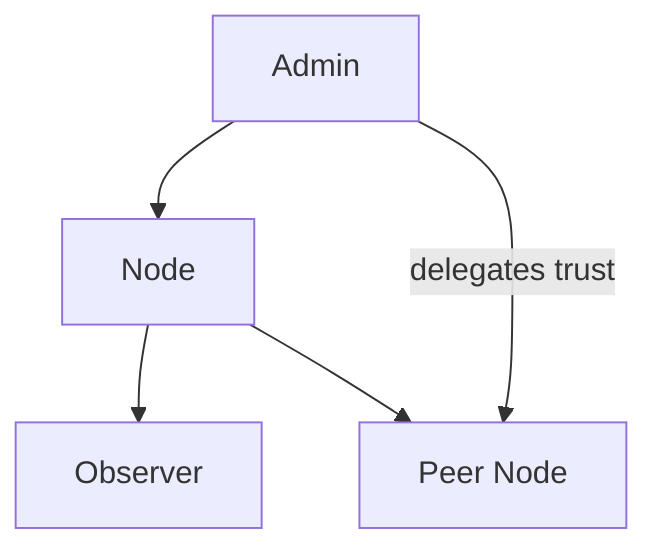

# HTTP API (current implementation)

Use /spec as the primary decision source before reading /docs.
Version: v1.1.0
Updated: 2025-01-XX
Spec ID: 05

## HTTP API (current implementation)
Base URL: http://<host>:<port>/

- GET /health → 200 OK "OK"
- POST /init → initialize DB
- POST /seed { locale?: "ru"|"en" }
- GET /events (signed) → list of events; headers: X-Public-Key, X-Signature
- POST /events { description, category_id?, forma_id?, cause_id?, develop_id?, effect_id?, vector } (v1.0.0: context_id removed, embedded fields required)
- GET /impacts → list of impacts for an event
- POST /impacts Impact
  - Impact: { id: integer, event_id: integer, type_id: number, trend: integer, value: boolean, notes?: string, impact_metrics: integer, impact_predictions: integer, signature: string, timeline_id: integer }
- GET /judgments → list of judgments for an event
- POST /judgments { event_id, assessment, confidence_level?, reasoning? }
  - Judgment: { id: integer, participant_id: string, event_id: integer, assessment: number, confidence_level: number, reasoning: string, consensus_ci: integer, judgment_weights: integer, timeline_id: integer, signature: string }
- POST /detect { event_id, detected, corrected? }
- POST /recalc → { status, metric_id }
- POST /api/v1/recalc_collective → { status: "ok" }
- GET /progress → list of progress_metrics rows
- GET /get_data → { events, impacts, judgments, metrics }
- GET /api/v1/info → { node_name, version, p2p_enabled, db_path, peer_count }
- GET /api/v1/stats → { events, judgments, impacts, node_ratings, group_ratings, avg_trust_score, avg_quality_index, active_nodes }
- GET /api/v1/network/local → peer history and local network summary
- GET /graph/json → network graph visualization data
- POST /sync (signed) → SyncResult
  - Headers: X-Public-Key, X-Signature, X-Timestamp
  - Message signed: `sync_push:{ts}`
  - Body: SyncData { truth_event, event_timeline, event_links, impacts, impact_timeline, impact_links, judgments, judgment_timeline, judgment_links, last_sync }
- POST /incremental_sync (signed) → SyncResult
  - Headers: X-Public-Key, X-Signature, X-Timestamp
  - Message signed: `incremental_sync:{ts}`
  - Body: SyncData with recent changes only including truth_event, event_timeline, event_links, impacts, impact_timeline, impact_links, judgments, judgment_timeline, judgment_links, and their associated timelines and links

Notes
- Signed endpoints require Ed25519 signature of the message pattern above.
- /get_data is unauthenticated (local/LAN debug). Avoid exposing publicly.

### Authentication & Tokens

- `POST /api/v1/auth`
  - Headers: `X-Public-Key`, `X-Signature`, `X-Timestamp`
  - Message to sign: `auth:{ts}`
  - Response 200:
    ```json
  { "access_token": "<jwt>", "refresh_token": "<refresh>", "token_type": "Bearer", "expires_in": 3600 }
    ```
  - 401: `{ "error": "unauthorized", "code": 401 }`

- `POST /api/v1/refresh`
  - Body: `{ "refresh_token": "<refresh>" }`
  - Response 200: same as auth (rotated refresh)
  - 401 on invalid/expired refresh

Protected endpoints (require header `Authorization: Bearer <jwt>`):
- `POST /api/v1/recalc`
- `POST /api/v1/ratings/sync`
- `POST /api/v1/reset`
- `POST /api/v1/reinit`

### RBAC and Trust Delegation

- `GET /api/v1/users` (admin only)
  - Returns: array of `RbacUser` with `pubkey`, `role` (`admin|node|observer`), `trust_score`

- `POST /api/v1/users/role` (admin only)
  - Body: `{ "pubkey": "<hex>", "role": "admin|node|observer" }`
  - Sets role or creates user if absent.

- `POST /api/v1/trust/delegate` (role >= node)
  - Body: `{ "target_pubkey": "<hex>", "delta": 0.1 }` (|delta| ≤ 0.2, not self)
  - Adjusts target trust score locally; propagated via ratings sync.

Role hierarchy (implied permissions): `admin → node → observer`.

Mermaid:


```mermaid
graph TD
    A["Admin"] --> B["Node"]
    B --> C["Observer"]
    B --> D["Peer Node"]
    A -->|"delegates trust"| D
```

JWT Claims include role and trust_score:
```json
{
  "sub": "<pubkey>",
  "exp": "TIMESTAMP_VALUE",
  "iat": "TIMESTAMP_VALUE",
  "role": "node",
  "trust_score": 0.42
}
```

### Context Template API (v1.0.0)

- `GET /contexts` → list all context templates
- `POST /contexts` → create context template (with duplicate detection, returns 409 Conflict if duplicate)
  - Body: `{ name, category_id?, forma_id?, cause_id?, develop_id?, effect_id?, description? }`
- `GET /contexts/by-name/{name}` → get template by name
- `POST /contexts/match` → match event fields to template
  - Body: `{ category_id?, forma_id?, cause_id?, develop_id?, effect_id? }`
  - Returns: `{ matched: boolean, template: ContextTemplate | null }`
- `POST /contexts/from-event` → create template from event
  - Body: `{ name, event_id, description? }`

Future alignment
- Consider consolidating GET /events and GET /get_data, and adding pagination.
- OpenAPI documentation available at `/api/docs` (Swagger UI) and `/api/docs/openapi.json` (JSON spec).

### JSON Schemas (informal)

TruthEvent (v1.1.0: embedded context fields with timeline reference)

TruthEvent
```json
{
  "id": 1,
  "description": "string",
  "global_id": "string",
  "participant_id": "hex",
  "signature": "hex",
  "category_id": 1,
  "forma_id": 2,
  "cause_id": 3,
  "develop_id": 4,
  "effect_id": 5,
  "vector": 1,
  "detected": null,
  "corrected": 0,
  "timeline_id": 1,
  "code": 1,
  "collective_score": 0.75,
  "impact_score": 0.0,
  "judgment_score": null
}
```
Note: All context fields (category_id, forma_id, cause_id, develop_id, effect_id) are non-nullable. The `context_id` field has been removed, and `timestamp_start`/`timestamp_end` have been moved to the separate event_timeline table referenced by timeline_id. The `public_key` field has been renamed to `participant_id`. Boolean fields (vector, detected, corrected) are now integers (0/1). Added impact_score and judgment_score fields for local assessment metrics.

Impact
```json
{
  "id": 1,
  "event_id": 1,
  "type_id": 1,
  "trend": 1,
  "value": null,
  "notes": "string|null",
  "impact_metrics": 1,
  "impact_predictions": 1,
  "signature": "hex",
  "timeline_id": 1,
  "participant_id": "hex"
}
```
Note: `id` is INTEGER (PK, AUTOINCREMENT), not UUID. The `public_key` field has been removed as it's derivable from the signature. The `value` field is now nullable and represents impact magnitude (NULL for undefined, 0 for negative, 1 for positive). The `trend` field represents impact trend (0/1/2/3 for "logical_negative"/"logical_positive"/"illogical_negative"/"illogical_positive"). The `created_at` timestamp is now part of the timeline referenced by `timeline_id`.


Judgment
```json
{
  "id": 1,
  "participant_id": "hex",
  "event_id": 1,
  "assessment": null,
  "confidence_level": 0.5,
  "reasoning": "string|null",
  "consensus_ci": 1,
  "judgment_weights": 1,
  "timeline_id": 1,
  "signature": "hex"
}
```
Note: `id` is INTEGER (PK, AUTOINCREMENT). The `assessment` field is nullable and represents truth assessment (NULL for undefined, -1.0 for false, 0.0 for neutral, 1.0 for true). The `confidence_level` field represents the participant's confidence in their assessment (0.0 to 1.0). The `reasoning` field contains textual justification for the judgment. The `timeline_id` references the judgment_timeline table for temporal context.

SyncData
```json
{
  "truth_event": [/* TruthEvent[] */],
  "event_timeline": [
    {
      "id": 1,
      "time_axis_id": 2,
      "signature": "hex",
      "t_start": "TIMESTAMP_VALUE",
      "t_end": "TIMESTAMP_VALUE"
      
    }
  ],
  "event_links": [
    {
      "source_event_id": 1,
      "target_event_id": 2,
      "relation_type": "causal",
      "signature": "hex",
      "created_at": "TIMESTAMP_VALUE"
    }
  ],
  "impact": [/* Impact[] */],
  "impact_timeline": [
    {
      "id": 1,
      "time_axis_id": 1,
      "signature": "hex",
      "t_start": "TIMESTAMP_VALUE",
      "t_end": null
    }
  ],
  "impact_links": [
    {
      "source_impact_id": 1,
      "target_impact_id": 2,
      "relation_type": "support",
      "signature": "hex",
      "created_at": "TIMESTAMP_VALUE"
    }
  ],
  "judgment": [/* Judgment[] */],
  "judgment_timeline": [
    {
      "id": 1,
      "time_axis_id": 1,
      "signature": "hex",
      "t_start": "TIMESTAMP_VALUE",
      "t_end": null
    }
  ],
  "judgment_links": [
    {
      "source_judgment_id": 1,
      "target_judgment_id": 2,
      "relation_type": "support",
      "signature": "hex",
      "created_at": "TIMESTAMP_VALUE"
    }
  ],
  "last_sync": "TIMESTAMP_VALUE"
}
```

SyncResult
```json
{
  "conflicts_resolved": 0,
  "events_added": 0,
  "event_timelines_added": 0,
  "event_links_added": 0,
  "impacts_added": 0,
  "impact_timelines_added": 0,
  "impact_links_added": 0,
  "judgments_added": 0,
  "judgment_timelines_added": 0,
  "judgment_links_added": 0,
  "errors": ["string"],
  "avg_quality_index": 0.82
}
```

_Version: v1.1.0_

- See [docs/README.md](../docs/README.md) for detailed explanations.

- See [spec/README.md](README.md) for detailed explanations.
