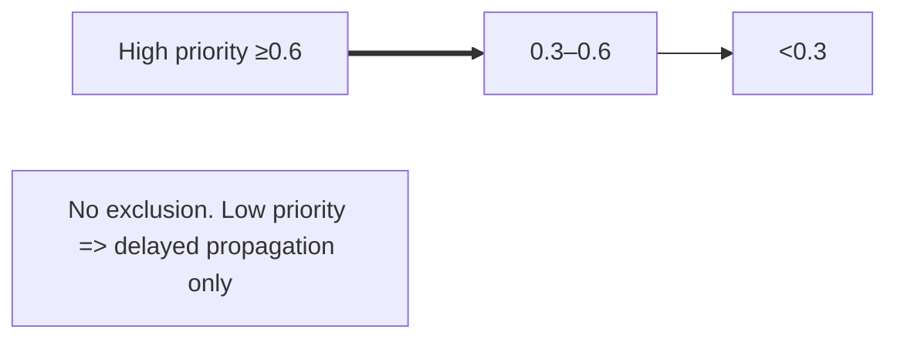

## P2P & Sync

### FidoNet-Inspired Peer Etiquette

**Core Principles:**
- **Delayed sync**: Nodes respect peer availability and sync when appropriate
- **Forward-ack exchange**: Nodes acknowledge receipt and forward data to other peers
- **Respectful intervals**: Avoid overwhelming peers with frequent sync requests
- **Zone addressing**: Support hierarchical node addressing (Zone:Net/Node)
- **Store-and-forward**: Nodes can operate offline and sync when reconnected

**Peer Behavior Guidelines:**
- **Sync intervals**: Minimum 5-minute intervals between sync attempts with same peer
- **Backoff strategy**: Exponential backoff on connection failures (5s, 10s, 20s, 40s, max 5min)
- **Graceful degradation**: Continue operation if some peers are unavailable
- **Data reconstruction**: Nodes can rebuild missing data via peer replication
- **Trust propagation**: Forward trust ratings and endorsements through the network

### Components

- **UDP Beacons**: discovery on port 37020. [src/net.rs]
- **CryptoIdentity**: Ed25519 keypair; sign/verify; hex helpers. [src/p2p/encryption.rs]
- **Node**: periodic sync loop with peer etiquette. [src/p2p/node.rs]
- **Sync flows**: /get_data (pull), /sync (push), /incremental_sync (delta). [src/p2p/sync.rs, src/api.rs]

### Security

- Signed requests with `X-Public-Key`, `X-Signature`, `X-Timestamp`.
- Message patterns (string to sign):
  - `sync_request:{ts}` for GET pull flows
  - `sync_push:{ts}:{ratings_hash}` for POST /sync
  - `incremental_sync:{ts}:{ratings_hash}` for POST /incremental_sync
- Ratings hash verification for trust propagation
- Future: per-item signatures and validator identity on impacts.

### Header Requirements

- `/sync` and `/incremental_sync` MUST include `X-Timestamp`; the server reconstructs the canonical message string for verification.
- `/get_data` is currently unauthenticated for LAN debug; do not expose publicly.
- Optional `X-Ratings-Hash` header for trust verification

### Sync Modes
### Trust-Based Propagation (Non-Discriminatory Mode)

- All peers may sync at any time; there is no trust filter to deny access.
- Trust affects only propagation priority via `propagation_priority ∈ [0,1]` stored in `node_ratings`.
- Formula: `priority = trust_norm*0.8 + recent_activity*0.2`, where `trust_norm = (trust_score+1)/2`.
- Relay scheduling: higher priority peers are broadcast first; peers with priority <0.6 get a small delay, <0.3 get a larger delay. Data still reaches everyone.

### Metrics Update and Propagation Feedback Loop

**Node Metrics Tracking:**
- **last_seen**: Timestamp of last successful sync with node
- **relay_success_rate**: Percentage of successful message deliveries
- **propagation_priority**: Real-time relay speed (0.0-1.0)
- **latency_ms**: Average response time between nodes

**Metrics Update Process:**
- After each sync operation, `upsert_node_metrics()` updates node performance data
- `merge_ratings()` automatically calls metrics update for incoming nodes
- Graph visualization includes real-time propagation and relay metrics
- CLI `truthctl status` shows network health with priority and success rates

Mermaid diagram:


**Full Sync (`/sync`):**
- Complete dataset exchange
- Used for initial peer connection or periodic full updates
- Includes all events, statements, impacts, and metrics

**Incremental Sync (`/incremental_sync`):**
- Delta updates since last sync timestamp
- More efficient for regular updates
- Includes only changed data since `last_sync`

**Pull-only (`/get_data`):**
- Unauthenticated data retrieval
- Used for LAN discovery and debugging
- Should not be exposed publicly

### Conflict Resolution

- **Timestamp-based**: Latest timestamp wins for conflicting data
- **Trust-weighted**: Higher trust scores influence resolution
- **Idempotent operations**: Safe to retry failed syncs
- **Audit logging**: All sync operations logged to `sync_logs` table

### Request/Response Formats

**POST /sync**
- Headers: X-Public-Key, X-Signature, X-Timestamp, X-Ratings-Hash (optional)
- Body (JSON):
```json
{
  "events": [TruthEvent...],
  "statements": [Statement...],
  "impacts": [Impact...],
  "metrics": [ProgressMetrics...],
  "node_ratings": [NodeRating...],
  "group_ratings": [GroupRating...],
  "last_sync": 1710000000
}
```
- Response: SyncResult { conflicts_resolved, events_added, statements_added, impacts_added, errors }

**POST /incremental_sync** — same headers; body contains only recent changes since `last_sync`.

### Roadmap

- Integrate conflict resolution into API/service layer.
- Apply incoming payloads to DB; idempotency and upserts.
- Add validator user_id to impacts and enforce sign/verify.
- Implement zone-based routing for large networks.
- Add peer reputation scoring based on sync reliability.
