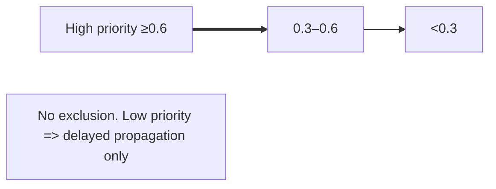

# P2P & Sync

Use /spec as the primary decision source before reading /docs.
Version: v1.1.0
Updated: 2025-01-XX
Spec ID: 08

### FidoNet-Inspired Peer Etiquette

**Core Principles:**
- **Delayed sync**: Nodes respect peer availability and sync when appropriate
- **Forward-ack exchange**: Nodes acknowledge receipt and forward data to other peers
- **Respectful intervals**: Avoid overwhelming peers with frequent sync requests
- **Zone addressing**: Support hierarchical node addressing (Zone:Net/Node)
- **Store-and-forward**: Nodes can operate offline and sync when reconnected

**Peer Behavior Guidelines:**
- **Sync intervals**: Minimum 5-minute intervals between sync attempts with same peer
- **Backoff strategy**: Exponential backoff on connection failures (5s, 10s, 20s, 40s, max 5min)
- **Graceful degradation**: Continue operation if some peers are unavailable
- **Data reconstruction**: Nodes can rebuild missing data via peer replication
- **Trust propagation**: Forward trust ratings and endorsements through the network

### Components

- **UDP Beacons**: discovery on port 37020. [src/net.rs]
- **CryptoIdentity**: Ed25519 keypair; sign/verify; hex helpers. [src/p2p/encryption.rs]
- **Node**: periodic sync loop with peer etiquette. [src/p2p/node.rs]
- **Sync flows**: /get_data (pull), /sync (push), /incremental_sync (delta). [src/p2p/sync.rs, src/api.rs]
- **Temporal synchronization**: Separate synchronization of event timelines (v1.1.0+) to handle future-dated events. [src/p2p/timeline_sync.rs]
- **Impact timeline synchronization**: Separate synchronization of impact timelines to handle temporally-bound impact assessments. [src/p2p/impact_timeline_sync.rs]
- **Judgment timeline synchronization**: Separate synchronization of judgment timelines to handle temporally-bound truth assessments. [src/p2p/judgment_timeline_sync.rs]
- **Entity linking synchronization**: Synchronization of relationship links between events, impacts, and judgments to maintain graph structure. [src/p2p/link_sync.rs]

### P2P Exchange Mechanics

The P2P exchange system synchronizes the following tables between nodes: "truth_event", "event_timeline", "event_links", "impact", "impact_timeline", "impact_links", "judgment", "judgment_timeline", "judgment_links". The "participants" table does not participate in direct P2P exchange, but when receiving data from other nodes, if a "participant_id" value (representing the public_key) from "truth_event", "impact", or "judgment" tables is not found in the local "participants.public_key" field, a new participant record is created with that public_key value.

**Unique Constraint in P2P Exchange**: During P2P synchronization, the unique constraint formed by "global_id" and "participant_id" ensures that each event is unique per participant. When nodes exchange "truth_event" data, an event with a specific "global_id" from a specific participant (identified by "participant_id") is treated as a unique entity. This prevents duplication of the same event from the same participant during synchronization.

**Participant Creation During Sync**: During P2P synchronization, when nodes exchange data for "truth_event", "impact", and "judgment" tables, the "participant_id" field in these tables actually represents the public key value of the participant. If this public key value does not exist in the local "participants.public_key" field, a new record is created in the local "participants" table with the public key value from the received "participant_id" field. This ensures that all nodes have the necessary participant records to properly associate events, impacts, and judgments with their creators.

**Signature Field Description**: All tables participating in P2P exchange (truth_event, impact, judgment, event_timeline, impact_timeline, judgment_timeline, event_links, impact_links, judgment_links) contain a "signature" field that is used to verify the authenticity and integrity of the data during synchronization.

### Security

- Signed requests with `X-Public-Key`, `X-Signature`, `X-Timestamp`.
- Message patterns (string to sign):
  - `sync_request:{ts}` for GET pull flows
  - `sync_push:{ts}:{ratings_hash}` for POST /sync
  - `incremental_sync:{ts}:{ratings_hash}` for POST /incremental_sync
- Ratings hash verification for trust propagation
- Future: per-item signatures and validator identity on impacts.

### Header Requirements

- `/sync` and `/incremental_sync` MUST include `X-Timestamp`; the server reconstructs the canonical message string for verification.
- `/get_data` is currently unauthenticated for LAN debug; do not expose publicly.
- Optional `X-Ratings-Hash` header for trust verification

### Sync Modes
### Trust-Based Propagation (Non-Discriminatory Mode)

- All peers may sync at any time; there is no trust filter to deny access.
- Trust affects only propagation priority via `propagation_priority ∈ [0,1]` stored in `node_ratings`.
- Formula: `priority = trust_norm*0.8 + recent_activity*0.2`, where `trust_norm = (trust_score+1)/2`.
- Relay scheduling: higher priority peers are broadcast first; peers with priority <0.6 get a small delay, <0.3 get a larger delay. Data still reaches everyone.

### Metrics Update and Propagation Feedback Loop

**Node Metrics Tracking:**
- **last_seen**: Timestamp of last successful sync with node
- **relay_success_rate**: Percentage of successful message deliveries
- **propagation_priority**: Real-time relay speed (0.0-1.0)
- **latency_ms**: Average response time between nodes

**Metrics Update Process:**
- After each sync operation, `upsert_node_performance()` updates node performance data
- `merge_ratings()` automatically calls metrics update for incoming nodes
- Graph visualization includes real-time propagation and relay metrics
- CLI `truthctl status` shows network health with priority and success rates

### Local Peer Tracking

- A local SQLite table `peer_synchronization` is maintained to record per-peer sync attempts:
  - Columns: `peer_url`, `last_sync`, `success_count`, `fail_count`, `last_quality_index`, `last_trust_score`.
  - Updated automatically after each sync attempt (success or failure).
- API: `GET /api/v1/network/local` returns JSON with `peers` array and `summary` object:
  - `peers[i]`: `{ url, last_sync (RFC3339), success_count, fail_count, last_quality_index, last_trust_score }`
  - `summary`: `{ total_peers, avg_success_rate, avg_quality_index }`
- CLI integration:
  - `truthctl peers stats [--format json|table]` prints the endpoint result in a human‑readable table or JSON.
  - `truthctl peers history [--limit N]` reads local DB table and prints recent rows for offline diagnostics.

Mermaid diagram:

```mermaid
flowchart LR
    High["High priority ≥0.6"] ==> Mid["0.3–0.6"]
    Mid --> Low["<0.3"]
    note["No exclusion. Low priority => delayed propagation only"]
```

**Full Sync (`/sync`):**
- Complete dataset exchange
- Used for initial peer connection or periodic full updates
- Includes all events, event timelines, event links, impacts, impact timelines, impact links, judgments, judgment timelines, judgment links
- Note: As of v1.1.0, temporal parameters (t_start, t_end) are stored separately in timeline tables and relationship links are stored in link tables, with both synchronized via their respective arrays
- Each entity (events, impacts, judgments) has its own temporal context and relationship structure maintained through separate synchronization

**Incremental Sync (`/incremental_sync`):**
- Delta updates since last sync timestamp
- More efficient for regular updates
- Includes only changed data since `last_sync`
- Includes incremental updates for events, impacts, judgments, and their associated timelines and links
- Timeline and relationship link information is synchronized alongside each entity to maintain proper temporal and relational context

**Pull-only (`/get_data`):**
- Unauthenticated data retrieval
- Used for LAN discovery and debugging
- Should not be exposed publicly

### Conflict Resolution

- **Timestamp-based**: Latest timestamp wins for conflicting data
- **Trust-weighted**: Higher trust scores influence resolution
- **Idempotent operations**: Safe to retry failed syncs
- **Audit logging**: All sync operations logged to `sync_attempts` table

### Request/Response Formats

**POST /sync**
- Headers: X-Public-Key, X-Signature, X-Timestamp, X-Ratings-Hash (optional)
- Body (JSON):
```json
{
  "truth_event": [TruthEvent...],
  "event_timeline": [EventTimeline...],
  "event_links": [EventLink...],
  "impact": [Impact...],
  "impact_timeline": [ImpactTimeline...],
  "impact_links": [ImpactLink...],
  "judgment": [Judgment...],
  "judgment_timeline": [JudgmentTimeline...],
  "judgment_links": [JudgmentLink...],
  "last_sync": "TIMESTAMP_VALUE"
}
```
- Response: SyncResult { conflicts_resolved, events_added, event_timelines_added, event_links_added, impacts_added, impact_timelines_added, impact_links_added, judgments_added, judgment_timelines_added, judgment_links_added, errors }
- Note: The TruthEvent, Impact, and Judgment objects reference their respective Timeline objects via timeline_id, and relationships between entities are maintained through link tables; this enables proper temporal synchronization and relationship preservation of all assessment types

**POST /incremental_sync** — same headers; body contains only recent changes since `last_sync`.

### Relay Metrics Propagation Logic

The system tracks relay success rates dynamically during sync operations:

1. **Metrics Collection**: Each sync operation calls `record_relay_result(peer_url, success)` to track success/failure rates.

2. **Storage**: Relay metrics are stored in the `node_performance` table with `relay_success_rate` (0.0–1.0).

3. **Propagation**: Metrics are flushed to the database periodically via `flush_relay_metrics_to_db()`.

4. **Visualization**: CLI and API endpoints display relay success rates with color coding:
   - 🟢 Green: >80% success rate
   - 🟡 Yellow: 50-80% success rate  
   - 🔴 Red: <50% success rate

5. **Integration**: Relay metrics influence trust propagation and node prioritization in the network.

### Collective Intelligence Propagation

- `collective_score` — aggregated event score (0..1), recalculated locally from `impact` and `judgment` entries and shared among nodes as part of distributed consensus propagation.
- Consensus converges iteratively: nodes recompute and exchange values; discrepancies diminish with subsequent recalculations and new evaluations.
- See [docs/Concept_Collective_Intelligence.md](../docs/Concept_Collective_Intelligence.md) for detailed implementation.

### Future Event Handling and Timeline Synchronization

- As of v1.1.0, events with future start/end dates are supported through the separate `event_timeline` table
- Temporal parameters (`t_start`, `t_end`) are synchronized separately from event metadata
- Each node maintains local state of event status based on current time:
  - Events with `t_start` in the future remain in `active` state until that date arrives
  - Events with `t_end` in the future remain `active` until that date arrives
  - Events with past `t_end` transition to `archived` state
- Original temporal parameters are preserved during aggregation when confirmed by other participants
- Forecasting capabilities enabled for future events using `impact_predictions` table

### Judgment Synchronization and Truth Assessment

- Participant judgments are synchronized separately to maintain independent assessment of events
- Each judgment includes participant identity, assessment value, confidence level, and reasoning
- Local `judgment_score` is recalculated based on incoming judgments from other nodes
- The system maintains the independence of truth assessment (judgment axis) from consequence assessment (impact axis)
- Judgment synchronization allows for distributed truth evaluation while preserving participant anonymity

## Propagation Priority Exchange

- `propagation_priority` (0.0–1.0) — adaptive propagation priority.
- Local calculation with EMA: p_raw = 0.4·trust_norm + 0.3·quality_index + 0.3·relay_success_rate,
  where trust_norm = ((trust_score+1)/2) and p = α·p_raw + (1-α)·prev, α=0.3.
- Network exchange and merging: blend_priority(local, remote) = clamp(0.8·local + 0.2·remote, 0..1).
- Value stored in `node_ratings.propagation_priority` and duplicated in `node_performance.propagation_priority` for visualization.

## Quality Index Exchange

- quality_index — trust continuity indicator (0.0–1.0), not a penalty for offline status.
- Transmitted as part of `node_performance` along with `relay_success_rate`.
- Local calculation: adaptive blend with EMA smoothing:
  - q_raw = 0.5·relay_success_rate + 0.3·conflict_free_ratio + 0.2·trust_score_stability
  - q = α·q_raw + (1-α)·prev, α=0.3
- When receiving remote metrics: `quality_index_local = clamp(0.8·local + 0.2·remote, 0..1)`.
- Removed any temporal penalties/decay: quality and trust do not decrease due to inactivity; fairness for mobile/offline nodes.

### Roadmap

- Integrate conflict resolution into API/service layer.
- Apply incoming payloads to DB; idempotency and upserts.
- Add validator user_id to impacts and enforce sign/verify.
- Implement zone-based routing for large networks.
- Add peer reputation scoring based on sync reliability.
- Enhance timeline synchronization for complex temporal relationships in future events.
- Improve forecasting algorithms for impact predictions of future events.
- Enhance judgment synchronization protocols for more efficient truth assessment propagation.
- Implement advanced conflict resolution for judgment disagreements between nodes.

For complete API specification, see [spec/05-api.md](05-api.md) which contains full API documentation.

_Version: v1.1.0_

- See [docs/README.md](../docs/README.md) for detailed explanations.

- See [spec/README.md](README.md) for detailed explanations.
