## P2P & Sync

### FidoNet-Inspired Peer Etiquette

**Core Principles:**
- **Delayed sync**: Nodes respect peer availability and sync when appropriate
- **Forward-ack exchange**: Nodes acknowledge receipt and forward data to other peers
- **Respectful intervals**: Avoid overwhelming peers with frequent sync requests
- **Zone addressing**: Support hierarchical node addressing (Zone:Net/Node)
- **Store-and-forward**: Nodes can operate offline and sync when reconnected

**Peer Behavior Guidelines:**
- **Sync intervals**: Minimum 5-minute intervals between sync attempts with same peer
- **Backoff strategy**: Exponential backoff on connection failures (5s, 10s, 20s, 40s, max 5min)
- **Graceful degradation**: Continue operation if some peers are unavailable
- **Data reconstruction**: Nodes can rebuild missing data via peer replication
- **Trust propagation**: Forward trust ratings and endorsements through the network

### Components

- **UDP Beacons**: discovery on port 37020. [src/net.rs]
- **CryptoIdentity**: Ed25519 keypair; sign/verify; hex helpers. [src/p2p/encryption.rs]
- **Node**: periodic sync loop with peer etiquette. [src/p2p/node.rs]
- **Sync flows**: /get_data (pull), /sync (push), /incremental_sync (delta). [src/p2p/sync.rs, src/api.rs]

### Security

- Signed requests with `X-Public-Key`, `X-Signature`, `X-Timestamp`.
- Message patterns (string to sign):
  - `sync_request:{ts}` for GET pull flows
  - `sync_push:{ts}:{ratings_hash}` for POST /sync
  - `incremental_sync:{ts}:{ratings_hash}` for POST /incremental_sync
- Ratings hash verification for trust propagation
- Future: per-item signatures and validator identity on impacts.

### Header Requirements

- `/sync` and `/incremental_sync` MUST include `X-Timestamp`; the server reconstructs the canonical message string for verification.
- `/get_data` is currently unauthenticated for LAN debug; do not expose publicly.
- Optional `X-Ratings-Hash` header for trust verification

### Sync Modes
### Trust-Based Propagation (Non-Discriminatory Mode)

- All peers may sync at any time; there is no trust filter to deny access.
- Trust affects only propagation priority via `propagation_priority ∈ [0,1]` stored in `node_ratings`.
- Formula: `priority = trust_norm*0.8 + recent_activity*0.2`, where `trust_norm = (trust_score+1)/2`.
- Relay scheduling: higher priority peers are broadcast first; peers with priority <0.6 get a small delay, <0.3 get a larger delay. Data still reaches everyone.

### Metrics Update and Propagation Feedback Loop

**Node Metrics Tracking:**
- **last_seen**: Timestamp of last successful sync with node
- **relay_success_rate**: Percentage of successful message deliveries
- **propagation_priority**: Real-time relay speed (0.0-1.0)
- **latency_ms**: Average response time between nodes

**Metrics Update Process:**
- After each sync operation, `upsert_node_metrics()` updates node performance data
- `merge_ratings()` automatically calls metrics update for incoming nodes
- Graph visualization includes real-time propagation and relay metrics
- CLI `truthctl status` shows network health with priority and success rates

### Local Peer Tracking

- A local SQLite table `peer_history` is maintained to record per-peer sync attempts:
  - Columns: `peer_url`, `last_sync`, `success_count`, `fail_count`, `last_quality_index`, `last_trust_score`.
  - Updated automatically after each sync attempt (success or failure).
- API: `GET /api/v1/network/local` returns JSON with `peers` array and `summary` object:
  - `peers[i]`: `{ url, last_sync (RFC3339), success_count, fail_count, last_quality_index, last_trust_score }`
  - `summary`: `{ total_peers, avg_success_rate, avg_quality_index }`
- CLI integration:
  - `truthctl peers stats [--format json|table]` prints the endpoint result in a human‑readable table or JSON.
  - `truthctl peers history [--limit N]` reads local DB table and prints recent rows for offline diagnostics.

Mermaid diagram:

```mermaid
flowchart LR
    High[High priority ≥0.6] ==> Mid[0.3–0.6]
    Mid --> Low[<0.3]
    note[No exclusion. Low priority => delayed propagation only]
```


**Full Sync (`/sync`):**
- Complete dataset exchange
- Used for initial peer connection or periodic full updates
- Includes all events, statements, impacts, and metrics

**Incremental Sync (`/incremental_sync`):**
- Delta updates since last sync timestamp
- More efficient for regular updates
- Includes only changed data since `last_sync`

**Pull-only (`/get_data`):**
- Unauthenticated data retrieval
- Used for LAN discovery and debugging
- Should not be exposed publicly

### Conflict Resolution

- **Timestamp-based**: Latest timestamp wins for conflicting data
- **Trust-weighted**: Higher trust scores influence resolution
- **Idempotent operations**: Safe to retry failed syncs
- **Audit logging**: All sync operations logged to `sync_logs` table

### Request/Response Formats

**POST /sync**
- Headers: X-Public-Key, X-Signature, X-Timestamp, X-Ratings-Hash (optional)
- Body (JSON):
```json
{
  "events": [TruthEvent...],
  "statements": [Statement...],
  "impacts": [Impact...],
  "metrics": [ProgressMetrics...],
  "node_ratings": [NodeRating...],
  "group_ratings": [GroupRating...],
  "node_metrics": [NodeMetrics...],
  "last_sync": 1710000000
}
```
- Response: SyncResult { conflicts_resolved, events_added, statements_added, impacts_added, errors }

**POST /incremental_sync** — same headers; body contains only recent changes since `last_sync`.

### Relay Metrics Propagation Logic

The system tracks relay success rates dynamically during sync operations:

1. **Metrics Collection**: Each sync operation calls `record_relay_result(peer_url, success)` to track success/failure rates.

2. **Storage**: Relay metrics are stored in the `node_metrics` table with `relay_success_rate` (0.0–1.0).

3. **Propagation**: Metrics are flushed to the database periodically via `flush_relay_metrics_to_db()`.

4. **Visualization**: CLI and API endpoints display relay success rates with color coding:
   - 🟢 Green: >80% success rate
   - 🟡 Yellow: 50-80% success rate  
   - 🔴 Red: <50% success rate

5. **Integration**: Relay metrics influence trust propagation and node prioritization in the network.

### Collective Intelligence Propagation

- `collective_score` — aggregated event score (0..1), recalculated locally from `impact` entries and shared among nodes as part of distributed consensus propagation.
- Consensus converges iteratively: nodes recompute and exchange values; discrepancies diminish with subsequent recalculations and new evaluations.

## Propagation Priority Exchange

- `propagation_priority` (0.0–1.0) — адаптивный приоритет распространения.
- Локальный расчёт с EMA: p_raw = 0.4·trust_norm + 0.3·quality_index + 0.3·relay_success_rate,
  где trust_norm = ((trust_score+1)/2) и p = α·p_raw + (1-α)·prev, α=0.3.
- Обмен по сети и слияние: blend_priority(local, remote) = clamp(0.8·local + 0.2·remote, 0..1).
- Значение хранится в `node_ratings.propagation_priority` и дублируется в `node_metrics.propagation_priority` для визуализации.

## Quality Index Exchange

- quality_index — индикатор непрерывности доверия (0.0–1.0), не является штрафом за оффлайн.
- Передается в составе `node_metrics` наряду с `relay_success_rate`.
- Локальный расчёт: адаптивная смесь с EMA-сглаживанием:
  - q_raw = 0.5·relay_success_rate + 0.3·conflict_free_ratio + 0.2·trust_score_stability
  - q = α·q_raw + (1-α)·prev, α=0.3
- При приеме удаленных метрик: `quality_index_local = clamp(0.8·local + 0.2·remote, 0..1)`.
- Убраны любые временные штрафы/decay: качество и доверие не уменьшаются из-за неактивности; fairness для мобильных/оффлайн узлов.

### Roadmap

- Integrate conflict resolution into API/service layer.
- Apply incoming payloads to DB; idempotency and upserts.
- Add validator user_id to impacts and enforce sign/verify.
- Implement zone-based routing for large networks.
- Add peer reputation scoring based on sync reliability.
