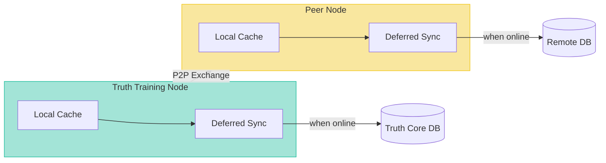
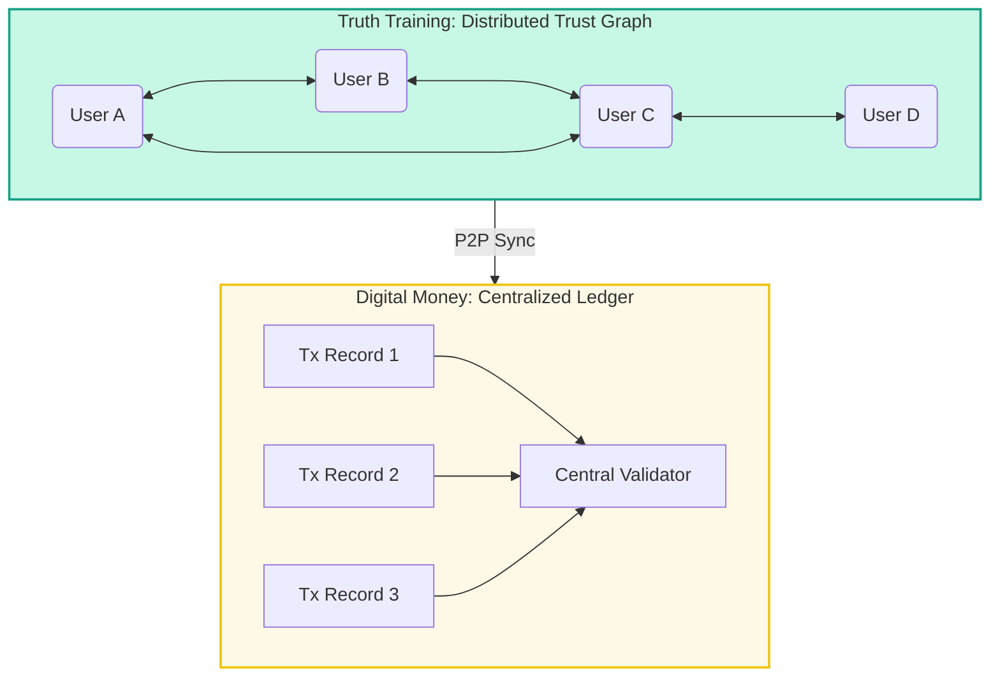

Offline Reliability and Data Integrity

(Truth Training vs Digital Money — Comparative Specification)

Version: v0.4.0
Spec ID: 09

⚙️ 1. Conceptual Overview

This specification compares Truth Training’s decentralized semantic reliability model with the offline transaction integrity model used in digital money systems (e.g., CBDC or hardware wallets).

The comparison highlights how Truth Core v0.4.0 preserves semantic truth and collective consensus even under offline conditions.

| Parameter | Truth Training (v0.4.0) | Digital Money (Offline) |
|-----------|-------------------------|-------------------------|
| **Data Type** | Semantic statements, trust ratings, events, collective judgments | Financial transactions |
| **Network** | Local P2P mesh (Wi-Fi / LAN / Bluetooth bridge) | P2P between wallets or NFC devices |
| **Node State** | May be offline; synchronizes later with consensus recalculation | May be offline until reconnected |
| **Data Protection** | Ed25519 signatures, trust propagation, collective verification | RSA/ECC signatures, secure enclave validation |
| **Verification** | Distributed trust graph + collective intelligence + weighted consensus | Central validator (upon sync) or TEE hardware trust |

🔁 2. Data Transmission Reliability

    📡 Truth Training (Decentralized Semantic Exchange)

Nodes exchange signed JSON messages (signature, public_key).

Messages are verified using Ed25519 and cross-checked via the trust propagation graph.

If the network is unavailable:

Data is cached locally.

Later synchronized via trust-weighted merge (merge_ratings).

Event IDs ensure idempotence — no duplication.

Upon reconnection:

Nodes merge their events with trust-based weighting (quality_index, propagation_priority).

Collective consensus (via collective_score) is recalculated automatically.

✅ Reliability:

Fully decentralized.

Loss of connectivity ≠ loss of data.

Achieves eventual semantic consistency.

    💳 Digital Money (Offline Transactions)

Typical use cases: CBDC tokens, hardware wallets, NFC payments.

A payer signs a transaction offline using a private key.

The receiver stores the signed payload.

Before rejoining the network, double-spend risk exists.

Upon reconnection:

The central validator cross-checks all token IDs.

Conflicting transactions are invalidated.

Hardware trust layers (TEE, Secure Element) guarantee wallet integrity.

✅ Reliability:

Centralized (issuer-controlled).

Offline integrity partially depends on hardware trust.

Full reconciliation occurs only after online synchronization.

🧩 3. Integrity Model Comparison

| Criterion | Truth Training | Digital Money |
|-----------|----------------|---------------|
| **Consensus Type** | Distributed trust graph + collective evaluation | Central validator or blockchain ledger |
| **Duplication Level** | High (redundant P2P copies) | Minimal (single issuer record) |
| **Data Loss Offline** | ≈ 0 (recovered via sync merge) | Possible if device is lost |
| **"Double Send" Risk** | None (idempotent events) | Possible before reconciliation |
| **Forgery Resistance** | High (Ed25519 + trust chain) | Very high (RSA/ECC + hardware trust) |
| **Integrity Without Internet** | High (semantic continuity) | Moderate (depends on hardware) |

🧠 4. Philosophical Difference in Reliability

| Aspect | Truth Training | Digital Money |
|--------|----------------|---------------|
| **Reliability Definition** | Ability to preserve and restore semantic information without a central authority | Ability to prevent double spending during offline operation |
| **Primary Goal** | Semantic Consistency (truth persists) | Monetary Consistency (value doesn't duplicate) |

    💬 Truth Training protects the meaning and authenticity of distributed facts.

    💰 Digital Money protects the uniqueness of value transfers.

🧮 5. Collective Reliability Layer (v0.4.0 Addition)

Version 0.4.0 introduces the Collective Intelligence Layer, enabling truth reconstruction through distributed consensus:

- **Judgment Submission**: Each node contributes independent evaluations with confidence levels
- **Reputation System**: Dynamic scoring based on judgment accuracy using EMA (Exponential Moving Average)
- **Consensus Calculation**: Weighted consensus algorithms aggregate judgments into collective truth scores
- **Outlier Filtering**: Statistical methods handle extreme judgments while preserving valuable minority perspectives

When nodes resynchronize:

- Collective averages are merged using trust-weighted algorithms
- Reputation scores are updated based on historical accuracy
- The system converges toward the same truth consensus, even after offline operation

✅ **Key Features:**
- Unlimited participation (no minimum participant count)
- Fully anonymous individual judgments (only aggregate consensus visible)
- Performance target: <100ms consensus calculation for 1000 participants
- No central validator needed — fully decentralized semantic reliability

📊 6. Network Architecture

🔄 7. Comparative Diagram: Trust Graph vs Ledger

🧩 8. Summary

Both systems ensure offline data transmission reliability but with distinct resilience principles:

| Focus | Reliability Source | Offline Consistency Type |
|-------|-------------------|-------------------------|
| **Truth Training** | Trust propagation, P2P redundancy, collective consensus | Semantic consistency (truth convergence) |
| **Digital Money** | Hardware trust, issuer reconciliation | Monetary consistency (non-duplication) |

Truth Training — more resilient for knowledge exchange.
Digital Money — stricter for value preservation.

🗂 9. Spec-Kit Links

Added in: spec/README.md → Network & Reliability

Related specs:

spec/03-architecture.md — Core topology

spec/04-data-model.md — Event + Impact schema

spec/08-p2p-sync.md — Trust propagation and synchronization

spec/17-offline-reliability.md — Current document